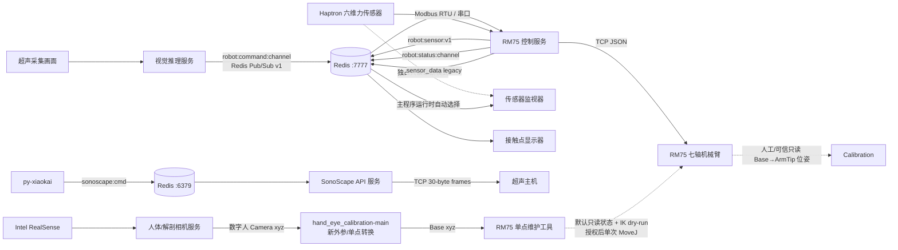

# USPilot Control 架构

## 文档范围

本文记录仓库中可独立运行进程之间的边界、API 层架构决策和依赖方向。设计决策的历史与
原因见 [DECISIONS.md](DECISIONS.md)。训练、预训练与数据实验目录属于离线工作负载，不作为
在线微服务。各运行服务的内部模块说明见本文末尾。

本仓库当前采用“同机多进程 + Redis 消息总线 + 设备 TCP/串口”的部署方式，并不是具有
服务发现、统一网关和容器编排的传统微服务平台。这里的“服务”指拥有独立入口、生命周期
和外部接口的运行组件。核心闭环服务提供独立模块文档，辅助服务仅在本页保留边界说明。

## 系统上下文



## 在线服务目录

| 服务 | 入口 | 对外接口 | 模块文档 |
| --- | --- | --- | --- |
| RM75 控制 | `infer/Robot/build/main_rm75` | Redis `:7777`、RM75 TCP、Haptron 串口 | [infer/Robot/ARCHITECTURE.md](infer/Robot/ARCHITECTURE.md) |
| 超声视觉推理 | `intergrate_infer/main_redis_seg_newphase_recovery_mode.py` | Redis Pub/Sub v1 | [intergrate_infer/ARCHITECTURE.md](intergrate_infer/ARCHITECTURE.md) |
| 人体/解剖相机 | `infer/Camera_RT/cliff_demo.py` | RealSense 输入、本地可视化、临时相机坐标路径 | [infer/Camera_RT/ARCHITECTURE.md](infer/Camera_RT/ARCHITECTURE.md) |
| 接触点显示 | `infer/ContactPointShow/main.py` | 只读订阅 `sensor_data` | — |
| 传感器监视 | `infer/SensorMonitor/main.py` | 自动选择独占直连 Haptron 或只读订阅 `robot:sensor:v1` | [infer/SensorMonitor/ARCHITECTURE.md](infer/SensorMonitor/ARCHITECTURE.md) |
| SonoScape API | `SonoScape_api/redis_service.py` | Redis 队列/结果键、超声 TCP | — |
| 语音/UI 客户端 | `py-xiaokai/main.py` | WebSocket/MQTT、Redis `:6379` | — |

数字人单点当前使用 `infer/hand_eye_calibration-main/transform_point.py` 和同目录的新
外参进行转换；`run_probe_target.py` 可统一启动数字人并在本次快照保存、正常退出后选取
第一采样点（相机按像素 y 降序保存，对应画面最低红点），调用 Robot 位置模式。编排入口默认速度1并自动传入双执行参数，`--dry-run` 可只规划；Robot 直接调用仍默认 dry-run。具体
变换数据保存在
`d455_to_rm75_base.json`，将 D455 光学坐标变为 Base 位置；Robot 的
`arm_probe_pose --target-position-base-m` 再读取启动 Probe TCP 姿态组成六维目标。
该离线转换不连接 RM75，也不授权真机运动。旧 `infer/Calibration` 外参不再用于该单点链路。
本机离线产物由 `artery_path_base.txt`、其 `.json` 元数据和
`d455_to_rm75_base.json` 组成；三者共同定义来源路径、相机身份、外参摘要和 Base 坐标语义。

## API 层架构决策

### 1. Redis 接口按用途隔离

- RM75 闭环固定使用 `127.0.0.1:7777`，控制命令、状态和传感器数据均为 Pub/Sub。
- SonoScape 与 `py-xiaokai` 默认使用 `127.0.0.1:6379`，命令采用 Redis List，结果采用
  带 TTL 的 String key。
- `py-xiaokai/src/roboredis_arm.py` 中的 `device:arm:*` 是另一套通用六轴接口，当前没有
  RM75 消费者，不能直接发布到 RM75 生产控制器。
- 新接口必须在服务文档中声明 Redis 实例、channel/key、消息语义、单位、版本和超时。

### 2. RM75 命令协议版本化并失效关闭

生产命令使用 `robot:command:channel` 的 JSON v1。`session_id` 标识生产者进程生命周期，
`sequence` 在会话内严格递增；重连、重复/回放序号、无效 JSON、订阅断开或命令超过
500 ms 均进入 Hold。生产者每 200 ms 重发最后命令，心跳也必须使用新序号。

```json
{
  "version": 1,
  "session_id": "uuid",
  "sequence": 1,
  "timestamp_unix_ms": 0,
  "parameters": {"y": 0.0, "rz": 0.0},
  "terminate": false,
  "action_state": false,
  "phase_idx": -1,
  "phase_confidence": 0.0,
  "recovery_mode": false,
  "mask_lr_majority": 0
}
```

字段约定：`y` 为米，`rz` 为度，`phase_idx` 为 `-1..2`，`phase_confidence` 为
`0..1`，`mask_lr_majority` 为 `-1..2`。可选的 `parameters.desired_force_n` 仅接受
`-3.0..-0.1 N`；协议解析范围不是允许绕过运行安全门的授权。

颈动脉单点不使用 Redis。Camera_RT 快照由 Calibration 转为 Base 文件，元数据绑定相机身份、
外参 SHA-256 与路径内容 SHA-256。Robot 维护工具重新计算“第一点 + 单位法向 × 50 mm”，
保持启动姿态做 IK；摘要、距离、关节限位、奇异或 Probe TCP 验收失败时拒绝 MoveJ。

### 3. 控制 API 与硬件 I/O 分离

`Rm75ControlLaw::Step` 是确定性控制边界：只接收快照和 `ControlIntent`，不访问 Redis、
socket 或串口。`Rm75ServoPlanner::Plan` 是第二道边界，将笛卡尔目标转换为关节目标并执行
关节限位、速度、加速度和奇异性检查。只有两层都成功，编排层才允许提交 ServoJ。

### 4. 10 ms 路径只消费内存快照

机器人、力传感器、Redis 收发和日志写盘均由各自 I/O 线程负责。控制循环不得增加阻塞式
网络访问、串口读取、JSON 序列化或磁盘写入。跨线程 API 使用带 sequence、时间戳、valid
和 stale 状态的完整快照，禁止共享可撕裂的字段集合。

### 5. 单位和坐标系是接口的一部分

- C++ 公共数据统一使用 SI：位置 m、关节/姿态 rad、力 N、力矩 N·m、单调时钟用于陈旧判定。
- 视觉命令的 `rz` 是协议层特例，单位为度，进入控制层后转换。
- 坐标链为 `Base → Arm_Tip → Tool/Sensor → Probe TCP`。
- 相机扩展链由离线 Calibration 单独提供 `D455 color optical → Base`；只有携带设备身份、
  输入摘要和独立验证结果的 `accepted` 外参才允许生成离线 Base 坐标文件。
- `robot:sensor:v1` 的接触点以 Probe TCP 为原点；legacy `sensor_data` 保持传感器原点语义。
- 新字段名必须包含单位或由同一 payload 的 `units` 明确声明，不允许靠调用方猜测。

### 6. 新旧协议只在边界兼容

RM75 同时发布结构化 `robot:sensor:v1` 和 legacy `sensor_data`，兼容逻辑集中在
`RedisBridge`。新消费者必须使用 v1；不得让 legacy 四元素数组扩散进新的内部 API。
旧六轴源码只保存在 `infer/Robot/tests/legacy/six_axis/`，不参与七轴生产依赖图。

### 7. 错误必须结构化并可追溯

硬件 API 返回结果对象或抛出明确的连接/协议/命令异常；不得在库层调用 `exit()`。
运行故障必须形成 fault/error code、Redis status 以及 CSV/summary 记录。Redis 发布成功只
表示消息进入 Redis，不表示机器人或超声设备已经执行。

### 8. 配置所有权固定

RM75 控制、规划和运行安全参数归 `rm75_control.hpp` 的三个 Config 结构所有；
`main_rm75.cpp` 负责装配、标定注入和生命周期。设备地址、模型权重和 Redis 端点仍有部分
硬编码，后续外置配置时应保留同样的校验和安全默认值，不能引入静默降级。

## 依赖方向

```text
视觉模型/相机 → VisionCommandPublisher → Redis v1
RedisBridge + RMStateReader + ForceSensorReader → main_rm75（编排）
ForceCalibration + ContactLocation → Rm75ControlLaw → Rm75ServoPlanner
Rm75ServoPlanner → RMCommand ServoJ mailbox → RM75 I/O owner
```

底层模块不得反向依赖入口程序：运动学不知道 Redis，控制律不知道设备句柄，传感器解析器
不知道状态机，UI/监视器不得写入生产控制 channel。

## 变更接口时的最低要求

1. 先更新生产者和消费者两侧的模块文档及示例 payload。
2. 新增协议版本，不在原版本中改变字段单位或含义。
3. 对必填字段、数值范围、重复序号、断线、超时和重连行为给出确定规则。
4. 保留 fail-closed 行为和结构化错误；不得用默认零值把无效数据伪装成有效输入。
5. Robot 模块的纯离线 CTest 必须通过后再进行真机验证；当前覆盖 parser、freshness、基础
   状态机、planner 拒绝边界和运行 schema，但尚未形成完整回放 harness。
6. 真机步骤遵守 [AGENTS.md](AGENTS.md) 的硬约束和
   [RM75 运行边界](PROGRESS.md)。
