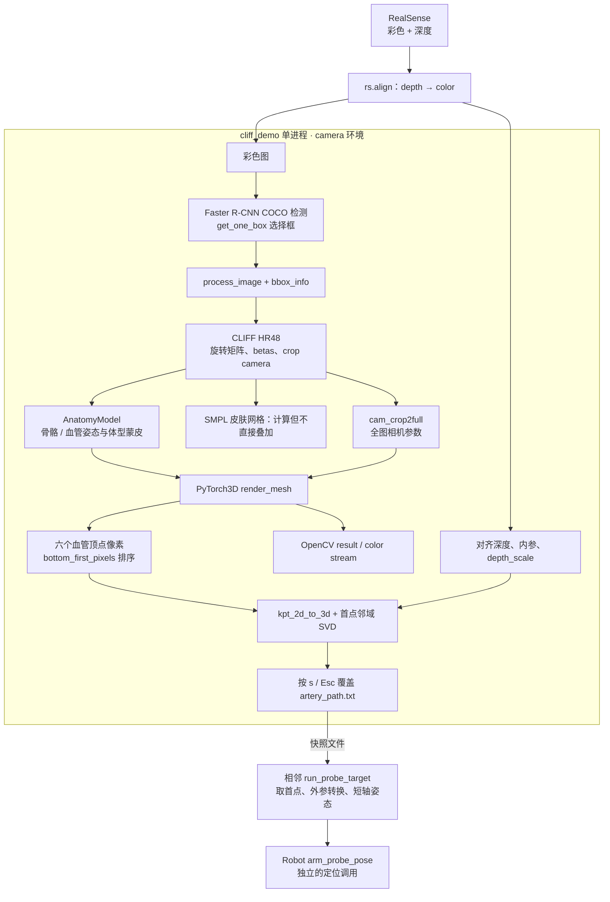
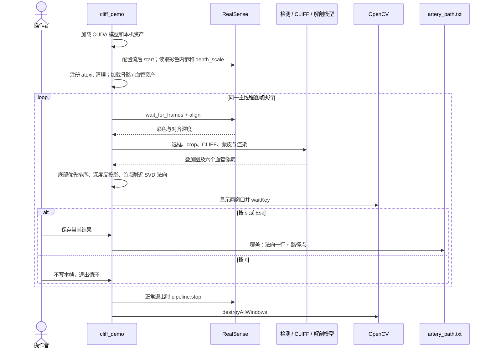
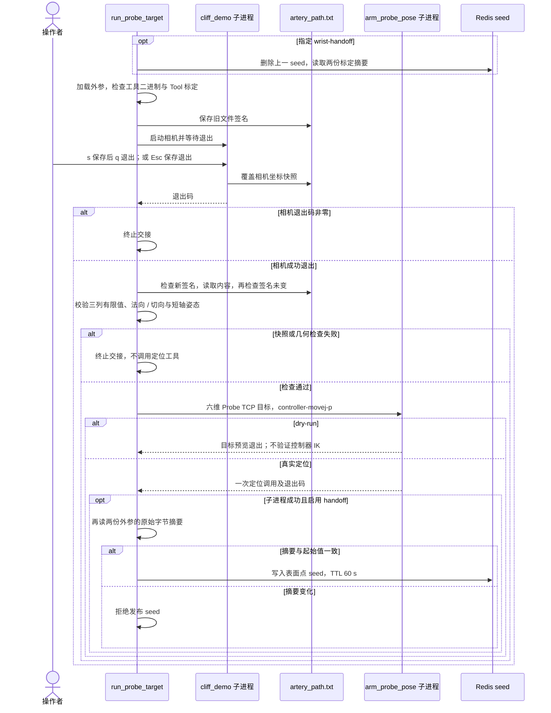

# Camera_RT 人体 / 解剖相机架构

本文依据 **2026-10-02 当前工作区源码**。本模块从 RealSense RGB-D 估计人体姿态与体型，
将骨骼 / 血管模型投影到彩色图，并将选定左颈动脉模型顶点的像素反投影为相机坐标路径。
入口 [cliff_demo.py](cliff_demo.py) 只采集、推理、显示和保存快照，不连接 Redis 或 RM75。

## 实现状态与边界

| 能力 | 状态 | 当前边界 |
| --- | --- | --- |
| RealSense 彩深采集、深度对齐彩色、读取内参与深度尺度 | 已实现 | 深度请求 Z16 / 30 FPS；彩色及分辨率由 SDK 配置选择，不写死 640×480 |
| Faster R-CNN → CLIFF HR48 → SMPL / AnatomyModel | 已实现 | 实际入口调用 `.cuda()`，没有可用的 CPU 后备路径 |
| 骨骼 / 血管叠加、左颈动脉六点反投影、首点法向估计 | 已实现 / 空间精度待验收 | 模型投影与深度估计，不能当作真实血管位置测量 |
| `s` 保存、Esc 保存退出、`q` 不保存退出 | 已实现 | 每次保存覆盖当前目录的 `artery_path.txt` |
| 无人体、遮挡、投影越界、深度孔洞的完整拒绝与恢复 | 规划 / 当前边界不完整 | 源码的选框和深度补点行为见后文，不套用腕部跟踪质量门限 |
| 相机到 Base 的转换、单点定位及可选腕部 seed | 相邻模块已实现 | 由 `hand_eye_calibration-main` 和 Robot 工具负责，非此相机进程职责 |
| 定位精度、外参残差与真机粗定位独立验收 | 待验收 | 预检、模型叠加和格式测试不能替代这些证据 |

现有源码与历史文档中的 `infer/Calibration` 方案不同：该目录已不存在，当前实际下游为
[run_probe_target.py](../hand_eye_calibration-main/run_probe_target.py)。Camera_RT 仍只输出相机坐标；
下游支持的转换不意味着相机自身已生成 Base 路径或独立验收元数据。

## 系统架构与模块

| 模块 | 当前职责 / 数据 | 源码位置 |
| --- | --- | --- |
| `cliff_demo` | 设备与窗口生命周期、模型编排、渲染、反投影、文本保存 | [cliff_demo.py](cliff_demo.py) |
| `get_one_box` | 在当前分数阈值下选择面积最大框；无框达标时递减阈值 | 同上；当前没有 COCO `labels==person` 过滤 |
| CLIFF HR48 | crop + bbox 信息 → 人体旋转、10 维体型和相机参数 | [models/cliff_hr48/cliff.py](models/cliff_hr48/cliff.py) |
| `common` | crop、估计焦距、crop-to-full 相机参数和权重键名适配 | [common/imutils.py](common/imutils.py)、[common/utils.py](common/utils.py) |
| `AnatomyModel` | 24 关节 pose 与 beta 驱动骨骼 / 血管模型蒙皮 | [anatomy_layer.py](anatomy_layer.py) |
| `render_mesh` | 平移后绕 Z 旋转 180°、渲染及选定血管顶点投影 | `cliff_demo.py`；渲染焦距来自图像尺寸估计 |
| `kpt_2d_to_3d` | 按对齐深度与实际彩色内参反投影 | `cliff_demo.py`；与渲染使用的估计焦距分开 |
| `tools` | 环境 / 资产预检、历史格式与像素排序离线测试 | [tools/README.md](tools/README.md) |
| `data/`、`lib/` | 本机模型资产 / 旧 YOLOv3 实现 | `data/` 不进入 Git；`lib/` 不在当前活动链路 |

`get_one_box` 从 0.9 开始，以 0.1 递减分数阈值，选择该轮达标框中的最大面积框；
不是固定阈值、唯一人体或目标身份跟踪。虽然用途是人体估计，当前检测输出中的类别标签
没有被过滤，非人体 COCO 框也可能被选入后续人体模型。

## 逐帧与保存时序

Esc 写入当前结果后退出，`s` 写入后继续。此前已经保存的文件不会因随后按 `q` 被删除。
正常退出主动清理；注册的 `atexit` 在常规解释器退出时兜底释放资源，不保证强制终止时执行。
没有独立采集线程、结果队列或曝光时间映射；该图不承诺推理帧率和端到端延迟。

## 快照接口与几何语义

| 项目 | 当前格式 / 算法 | 使用限制 |
| --- | --- | --- |
| 文件路径 | 启动工作目录中的 `artery_path.txt`；下游约定 `Camera_RT/` | 相对路径，重复保存覆盖；不是实时消息 |
| 第一行 | 三个法向分量，保留 3 位小数 | 无量纲方向，转换到 Base 时只乘旋转；舍入后不保证精确单位长度 |
| 后续行 | 每行三个相机坐标，保留 6 位小数，单位 m | RealSense 光学系：X 向右、Y 向下、Z 向前 |
| 当前采样点 | 左颈动脉模型顶点 `[43976,43975,15973,43908,43907,5163]` | 固定模型索引，不是从图像或超声直接分割血管 |
| 点顺序 | 图像 Y 从大到小稳定排序 | 第二行是画面最下面采样点；等 Y 保留原顺序，不按三维 Y 排序 |
| 三维位置 | `z=depth×depth_scale`；`x=(u-ppx)/fx×z`、`y=(v-ppy)/fy×z` | 使用彩色流实际内参和对齐深度 |
| 法向 | 首点像素附近 4×4 邻域反投影，SVD 最小方向；若 Z>0 则翻转 | 仅保证该符号约定；没有平面 RMS、内点比例或非共线门限 |
| 元数据 | 无时间戳、序号、设备身份、单位 / frame 字段或标定摘要 | 文件本身不提供时效及空间验收证据 |

`kpt_2d_to_3d` 将取深度用的像素整数索引限制在图像上界，未完整检查下界；
深度为零时搜索**全图最近非零深度像素**，随后仍用原始投影像素的射线计算三维坐标。
该补点没有距离上限、局部表面一致性或置信度检查，不能称为同点有效深度测量。
全图无非零深度、无检测框或缺少完整帧时尚无统一拒绝 / 恢复状态机，可能异常退出。

输出窗口为 `result`（骨骼 / 血管叠加）和 `color stream`（采样像素辅助画面），均缩放到
800×600。文件内坐标来自缩放前的原图；画面里的标记不能据此认作 P0 真值。
旧 `artery_path_rbt.txt` 没有可信生成器或当前 schema，文件名不能证明坐标属于机器人。

## 实际下游交接

| 步骤 | 已实现行为 | 源码 / 验收边界 |
| --- | --- | --- |
| 采集快照 | `run_probe_target` 记录旧文件签名，运行相机，成功退出后要求新快照且读取期间未变 | [run_probe_target.py](../hand_eye_calibration-main/run_probe_target.py)；签名含 device / inode / size / mtime / ctime，mtime 不是曝光时间 |
| 提取首点 / 方向 | 一行非零法向 + 至少两点；取首点与第一个间距 >1 μm 的后续点，单位化法向与切向 | 同上；所有行必须三列有限值；单位切向在切平面的投影范数 <0.001 时拒绝短轴姿态 |
| 相机 → Base | `p_base=R×p_camera+t`；方向只乘 R | [transform_point.py](../hand_eye_calibration-main/transform_point.py) |
| 构造短轴姿态 | Tool +Z 朝内，-X 沿血管投影切向；沿 Tool -Z 后退 50 mm | `run_probe_target`；50 mm 是计算偏置，不是实际净空 |
| 单点调用 | 传 `--target-pose-m-rad --controller-movej-p` 给 `arm_probe_pose` | [Robot 维护工具](../Robot/tests/tools/arm_probe_pose.cpp)；默认编排可执行运动，非只读相机功能 |
| 可选投影 seed | `--wrist-handoff` 起始先删除旧 seed；非 dry-run、定位子进程成功退出且两份外参摘要未变才写入 TTL 60 秒 seed | `scope=projection_preview_only`；不授权腕部自动运动；dry-run 也会删除旧 seed，但不发布新 seed |

图中检查是文件一致性与数值 / 几何退化门，不能证明模型选对血管或深度来自同一表面。
`artery_path.txt` 本身没有曝光时间；重新保存只满足本次文件变化要求。
摘要变化会拒绝 seed 发布；单独的 `scope=projection_preview_only` 不启动腕部运动。

当前 `load_transform` 校验方向、米制、`user_confirmed` 和刚体矩阵，**不以独立残差验收作为代码门**；
它与历史 Base 路径工具要求的 `accepted` 外参 / sidecar 是不同接口。
`--dry-run` 只预览并不发送 MoveJ_P，也不做本地 IK / 可达性检查。
具体运动权限和后端差异见 [Robot 架构](../Robot/ARCHITECTURE.md#颈动脉单点维护流程)。

## 依赖、验证与规划

依赖 Torch / torchvision、PyTorch3D、SMPL、Open3D、OpenCV、RealSense SDK、NumPy、SciPy 等。
[requirements.txt](requirements.txt)和[tools/preflight.py](tools/preflight.py)记录本模块预检基线，
不是全仓库或当前设备的通用版本锁。七个本机资产由 [assets.sha256](tools/assets.sha256)检查，
Faster R-CNN 权重另由 Torch 缓存提供。入口不会自动运行预检或资产哈希校验。

| 检查 / 后续工作 | 状态与覆盖范围 | 不包含的结论 |
| --- | --- | --- |
| `tools/preflight.py --static` | 已实现：解释器、包、源码语法、七个本机资产 | 无实时推理、设备流或空间精度验收 |
| `tools/preflight.py --runtime` | 已实现：含 static，再枚举 GPU / CUDA、RealSense 与权重缓存；不打开流或下载权重 | 硬件枚举不等于采集与显示成功；缓存缺失可报告 WARN |
| [test_path_format.py](tools/test_path_format.py) | 已实现：旧夹具三列有限值 / 结构 characterization | 不认可旧数据空间坐标或真实路径质量 |
| [test_sample_order.py](tools/test_sample_order.py) | 已实现：生产排序函数的底部优先、稳定顺序和非法输入 | 不验证检测、深度、血管对应或法向 |
| 检测类别 / 无框、像素与深度、局部平面质量、采集元数据 | 规划补齐 | 当前不能宣称存在这些完整拒绝门 |
| 真实采集、人体叠加、独立空间 / 外参 / 动态时序验收 | 待验收 | 不能以预检或格式测试代替 |

本次文档更新只核对当前源码，不新增设备运行或真机验收记录。长期原因见
[DECISIONS.md](DECISIONS.md)，本机操作与历史状态见
[Camera_RT 操作 notebook](../../.runme/run/camera-rt-operations.md)和
[Camera_RT 进展 notebook](../../.runme/Progress/camera-rt-progress.md)。本机 `.runme/` 不随仓库分发。
