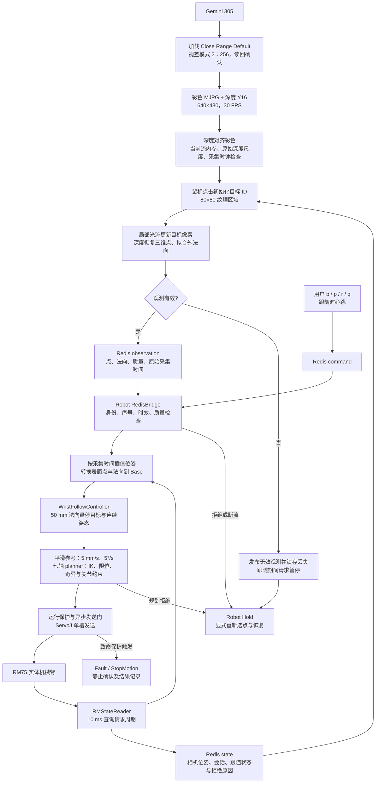
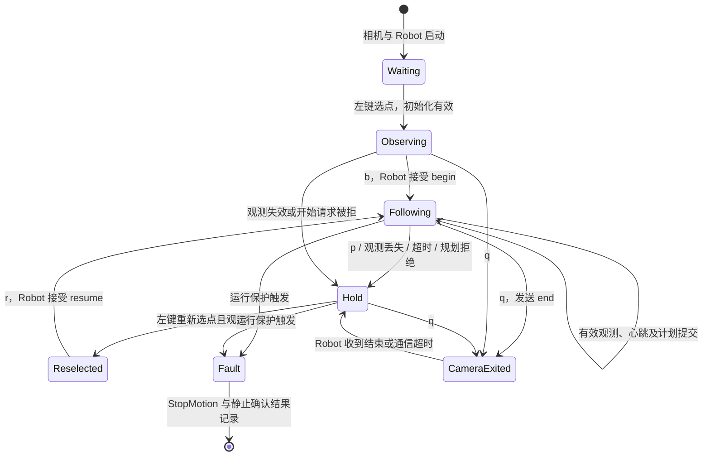

# Camera_wrist 架构

Orbbec Gemini 305 腕部 RGB-D 采集、局部追踪与表面法向估计。
当前主入口通过鼠标选取可见纹理表面点，经 Redis 接入 Robot 的 50 mm 悬停跟随；不识别血管。

| 入口/模块 | 用途 |
| --- | --- |
| [click_follow.py](click_follow.py) | 独立点击观测或 Redis 跟随，不需要全局相机/seed |
| [projection_preview.py](projection_preview.py) | 全局 seed 投影；加 --track 做本地追踪，不发布控制请求 |
| [gemini_config.py](gemini_config.py) | 近距离预设、视差读回与视频流选择 |
| [local_tracker.py](local_tracker.py) | LK 光流、局部仿射与深度平面法向 |
| [wrist_projection.py](wrist_projection.py) | 标定读取、位姿插值和投影 |
| [tracking_diagnostics.py](tracking_diagnostics.py) | 失效事件与图像证据 |

数据流：Gemini → 相机坐标观测 → Redis → Robot 坐标转换/控制/planner；Robot 回传相机位姿和状态。
标定采集与求解见 [hand_eye_calibration-main](../hand_eye_calibration-main/USAGE.md)。
[腕部外参](gemini305_to_rm75_armtip.json) 定义 Camera→ArmTip 变换；标定与验收状态见 [PROGRESS.md](PROGRESS.md)。

实现进度见 [PROGRESS.md](PROGRESS.md)，环境与操作见 [USAGE.md](USAGE.md)。

## 点击跟随全流程

主链路直接选取 Gemini 可见表面点，不需要全局相机、数字人、粗定位或 seed。
相机进程只生成观测和操作请求；Robot 独占机器人状态读取、坐标转换、规划和运动发送。
`--no-redis` 只运行相机观测，不建立机器人闭环。



### 相机观测生成

启动配置集中在 [gemini_config.py](gemini_config.py)，两个相机入口共用。
预设、视差读回不符或视频流组合不支持时退出，不自动降低帧率。
640×480、视差 256 在用户提供的 Gemini 305 表中 Minimum-Z 为 40 mm；
约 80 mm 是预期相机工作距离，不是程序保证的测距精度，也不是机器人 TCP 目标距离。

点击位置先检查深度和纹理；跟踪采用 Shi–Tomasi 特征、金字塔 LK 前后向检查、
RANSAC 局部仿射，使用仿射更新原目标像素，不以特征均值替换目标。
邻域三维点用于稳健平面拟合，法向统一朝相机。

| 检查 | 当前门限 |
| --- | --- |
| 纹理区域 | 80×80 像素，完整区域必须在画面内 |
| 光流一致特征 | 至少 12 个；前后向误差 ≤1 px |
| 仿射内点比例 | ≥0.6；轴向尺度 0.9～1.1，另检查行列式 |
| 像素 / 三维跳变 | ≤15 px/帧；≤10 mm/帧 |
| 法向点云 | 15 mm 邻域，至少 50 点；平面内点比例 ≥0.7 |
| 平面误差 | RMS ≤2 mm，另检查目标到平面距离与点云退化 |
| 帧间采集时间 | 递增且间隔 ≤200 ms |

640×480 图像中，目标靠近边缘约 40 像素以内，即可能无法容纳完整 ROI。
红点仍可见也可能报 `80x80 tracking ROI outside image`；不裁剪区域继续追踪。

### Robot 坐标与参考生成

按照观测采集时刻取得插值位姿，使用以下坐标链（位置单位 m）：

```text
T_base_camera(t) = T_base_armtip(t) × T_armtip_camera
p_surface_base  = R_base_camera × p_camera + t_base_camera
n_out_base      = R_base_camera × n_out_camera
p_tcp_goal      = p_surface_base + 0.050 × n_out_base
Tool-Z          = -n_out_base
```

Tool-X 使用上一参考姿态的 X 轴在新切平面上的投影，退化则 Hold。
姿态候选与上次接受的目标旋转比较：变化不超过 **5°** 时保持目标，超过才更新。
开始和恢复时重置接受目标；位置偏置继续使用原始有效法向，姿态死区不修改观测。
因此上述 Tool-Z 公式描述候选方向，接受目标在死区内可以偏离瞬时法向。
开始或确认恢复时，从实测 TCP 和关节重建参考；后续每次成功提交计划后才推进参考。
50 mm 只添加一次，表示目标 TCP 到局部表面的法向间距，不保证瞬时实测间距或夹板净空。
5 mm/s、5°/s 限制的是 TCP 参考生成，不能据此推断实际机械臂始终满足同一速度。

腕部模式独立管理参考，不进入超声 Tool-Y 参考自动重置分支。
腕部实测 TCP 与规划模型位置误差门限为 **50 mm**；普通超声模式仍为 25 mm。
配置见 `Rm75RuntimeSafetyConfig` 与 `RobotRuntimeConfig::EffectiveSafety()`。

### 操作、Hold 与退出



左键不启动运动；跟随期间不能直接换点。心跳不会刷新观测采集年龄，也不会解除锁存。
`q` 退出相机而 Robot 保持 Hold；Robot 的 `Ctrl+C` 或致命故障进入停止流程。
Hold 仍可能通过当前模型关节发送保持目标，不等同于断电或已确认实体静止。
`stop_not_physically_confirmed` 表示静止确认未通过，不能记录为安全停止验收成功。

当前 [start_robot.sh](start_robot.sh) 显式启用真实腕部执行、无力传感器、候选外参试验、
取消累计位移/累计转角上限，并持续运行至中断或故障；仍需要点击后按 b/r 才请求跟随。
它不读取力传感器，不进行 tare 或力闭环；机器人标定文件仍用于 TCP 几何。
关节、规划、通信、周期、跟踪误差与停止保护仍保留，启动脚本不会自动完成空间验证。

### 日志与诊断职责

- 相机：`log/wrist_click_*.jsonl` 记录配置、点击、观测、操作请求和拒绝原因；
  同名 `.tracking/` 目录记录丢失诊断与图像证据。
- Robot：`log/wrist_continuous_*/runtime.csv` 记录参考、规划关节、实测状态与故障；
  `runtime.csv.wrist.csv` 记录点、法向、间距、采集年龄、插值跨度及 planner 结果；
  `runtime.summary.json` 记录有效配置和最终停止结果。
- 排查时按同机单调时间关联两端日志。相机 `Robot state timeout` 可能是 Robot
  已发生 Fault 的后果，应先查 Robot 首个故障；`operator_paused` 也可能来自相机自动暂停。
- 运行结果、问题排查、测试结论和待验收事项统一记录在 [PROGRESS.md](PROGRESS.md)。

## Redis 接口

实例：127.0.0.1:7777。位置 m，矩阵采用列向量，T_A_B 将 B 映射到 A。
SHA-256 按标定文件原始字节计算，包括空白。

| 名称 | 类型/方向 |
| --- | --- |
| robot:wrist:state:v1 | Pub/Sub，Robot → 相机 |
| robot:wrist:observation:v1 | Pub/Sub，点击入口 → Robot |
| robot:wrist:command:v1 | Pub/Sub，点击入口 → Robot |
| robot:wrist:seed:v1 | TTL 60 秒键，粗定位 → 投影模式；点击模式不读写 |

### 点击模式

Robot 参数为 --wrist-follow FILE，状态 scope=click_follow，与投影模式互斥。

观测/命令公共字段：version=1、runtime_session_id、producer_id、target_id、sequence、
timestamp_monotonic_ns、boot_id、calibration_sha256（腕部摘要字符串）、
frame=gemini305_color_optical、length_unit=m。每个 producer、每个通道分别维护递增正整数序号。
producer_id 每进程更新，target_id 每点击更新；pause/end 可为空目标，其余请求不可为空。

有效观测附加字段（以下片段需合并公共字段）：

```json
{"valid":true,"capture_monotonic_ns":123456789000,"pixel":[320,240],"point_camera_m":[0,0,0.2],"normal_out_camera":[0,0,-1],"quality":{"surface_points":100,"feature_inliers":20,"plane_rms_m":0.001,"plane_inlier_ratio":0.95}}
```

点必须有限且 z>0；法向单位化并朝相机，normal·point<0。
Robot 质量检查为 feature_inliers>=12、surface_points>=50、plane_rms_m<=0.002、plane_inlier_ratio>=0.7。
valid=false 带 reason，停止使用坐标并锁存 Hold。

命令附加 action=begin/resume/pause/end/heartbeat。跟随中约每 100 ms 发心跳，500 ms 超时 Hold。
开始被拒、丢失或重启后均需新点击并 resume；心跳不刷新曝光时间、不解除 Hold。
会话/boot/摘要/坐标不符、重复乱序、旧采集时间、断线或无效观测会被拒绝或锁存。
新目标只在 Hold 中显式接管，跟随中切换目标会停止；Pub/Sub 丢失结束消息时由超时处理。

状态含 version、scope、runtime_session_id、boot_id、calibration_sha256（字符串）、frame、length_unit、
sequence、timestamp_monotonic_ns、valid、T_base_camera、control_state，以及：

- follow_state=following/hold、follow_reason、target_id；
- request_producer_id、request_sequence（最近处理的显式请求）、resume_required；
- actual_normal_gap_m、target_normal_gap_m=0.050、observation_age_ms、pose_span_ms、
  surface_base_m、normal_base、goal_tcp_base_m；
- pose_time_basis=host_feedback_receive_not_controller_sample。

Robot 计算 T_base_camera=T_base_armtip*T_armtip_camera；目标为 surface_base+0.050*normal_out_base。
Tool-Z 朝内、Tool-X 切平面连续，恢复从实测 TCP/关节建立参考，再经 planner；限速见使用说明。

### 时序

[projection_preview.py](projection_preview.py) 中共享 CaptureClock 将 SDK global capture 映射到同机单调时钟：30 帧预热，wall/monotonic 采样跨度 <=1 ms、
相邻偏移变化 <=2 ms、彩深差 <=20 ms。采集时间递增、观测年龄 <=200 ms。
按采集时刻插值 Robot 位姿（平移线性、旋转 SLERP），跨度 <=50 ms，不外推。
状态保留原反馈序号和接收时间，不因重发刷新；机器人接收时刻不是控制器采样时刻，延迟需独立量测。

### 投影模式

scope=projection_preview_only；不发布观测/命令，--track 结果仅写日志。
与点击状态共用 channel，但 calibration_sha256 为 {global,wrist} 对象，不能混用。

seed 字段：version=1、session_id、target_id、sequence=1、timestamp_monotonic_ns、expires_monotonic_ns、
boot_id、camera_serial、calibration_sha256、surface_point_base_m、initial_tool_rotation_base、
frame=rm75_base、length_unit=m、coarse_positioning_succeeded=true、scope、independently_validated=false。
surface_point_base_m 不含 50 mm 后退；sample_unix_ns 是文件 mtime，
sample_time_basis=snapshot_file_mtime_not_exposure，不是曝光时间。

状态继承 version/session_id/target_id/boot_id/calibration_sha256，增加 runtime_session_id、sequence、
timestamp_monotonic_ns、T_base_camera、frame=gemini305_color_optical、length_unit=m、valid、control_state、scope，
pose_time_basis=host_feedback_receive_not_controller_exposure。
Robot 启动读取有效 seed 后固定身份；预览遇到运行会话变化退出，不自动换目标。

实现入口：[click_follow.py](click_follow.py)、[wrist_projection.py](wrist_projection.py)、
[RedisBridge](../Robot/src/redis_bridge.cpp)。操作见 [点击跟随](USAGE.md#点击跟随) / [投影预览](USAGE.md#全局投影与追踪预览)。
