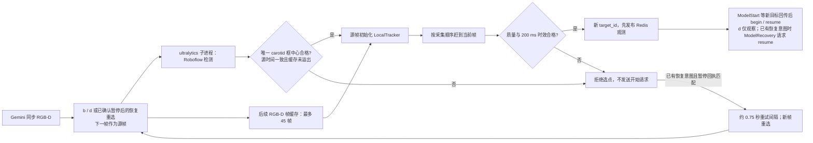
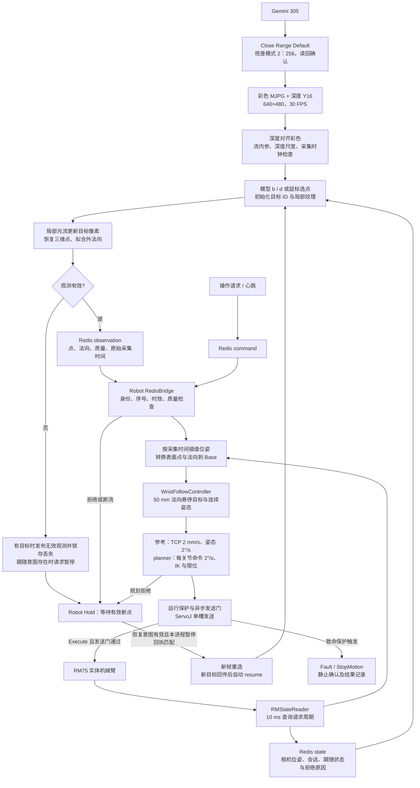
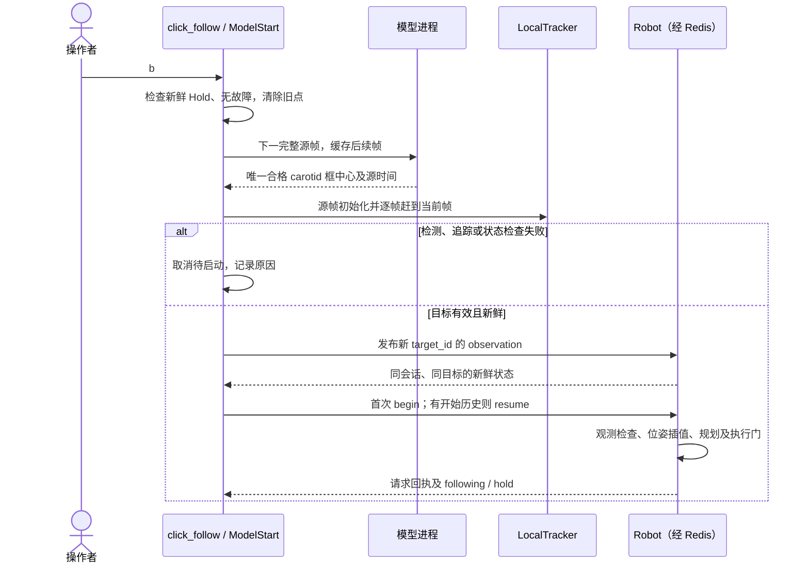
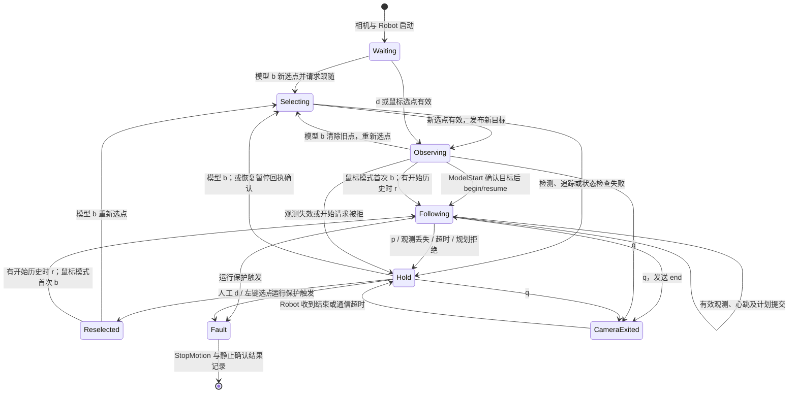
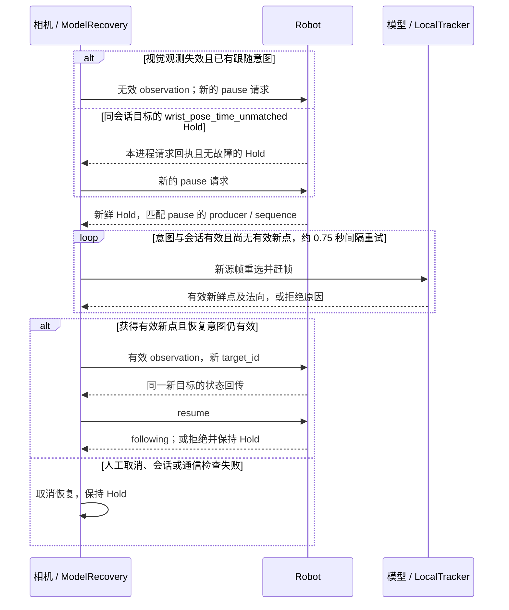
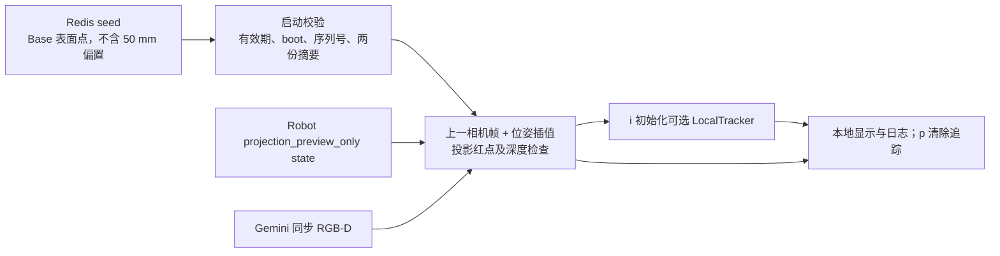

# Camera_wrist 架构

本文依据 **2026-10-02 当前工作区源码**。Orbbec Gemini 305 提供腕部同步 RGB-D，
本模块负责选点、局部追踪、表面法向和观测发布；Robot 独占坐标转换、规划与运动发送。
当前默认脚本使用 Roboflow 检测 `carotid`，模型模式按 `b` 新选点并请求跟随、`d` 只选点。
直接调用 `click_follow.py` 且不传模型 ID 时保留鼠标选点；两者始终连接 Redis。

| 能力 / 路径 | 状态 | 当前边界 |
| --- | --- | --- |
| 同步 RGB-D、模型 / 鼠标选点、光流与表面法向 | 已实现 | 标准质量门限；程序有效不等于位置真值已验收 |
| 同源帧检测融合、单键开始、暂停回执后的自动恢复 | 已实现 / 真实目标待验收 | 模型服务独立进程；Robot 任意 Hold 不都可恢复 |
| 全局 seed 投影与可选本地跟踪 | 已实现 / 空间与时序待验收 | `projection_preview_only`，不发布控制请求 |
| 外参、TCP 净空、动态定位与连续恢复独立评估 | 待验收 | 外参仍为 `independent_validation_recorded=false` |
| 无力悬停与接触超声力控自动交接 | 后续扩展，当前未实现 | 当前专用脚本不采集力、不执行力闭环 |

| 入口/模块 | 用途 |
| --- | --- |
| [click_follow.py](click_follow.py) | 模型 / 点击观测、窗口、ClickSession、ModelStart、ModelRecovery 与 Redis 请求，不需要全局相机/seed |
| [model_selection.py](model_selection.py) | 模型子进程、后台私有 socket 请求、源帧缓存 / 赶帧、检测中心时间对齐融合 |
| [launch_wrist_terminal.sh](launch_wrist_terminal.sh) | Runme/普通终端统一启动入口：按 `robot` 或 `camera` 打开独立窗口并防止重复启动 |
| [start_camera.sh](start_camera.sh) | 激活 `camera` 环境、模型参数与终端日志；首批完整帧超时退出码 7 时只重启一次，不启动 Robot |
| [start_robot_terminal.sh](start_robot_terminal.sh) | Runme 机器人独立终端：调用既有 `start_robot.sh` 并保留终端输出与退出码 |
| [projection_preview.py](projection_preview.py) | 全局 seed 投影；加 --track 做本地追踪，不发布控制请求 |
| [gemini_config.py](gemini_config.py) | 近距离预设、视差读回与视频流选择 |
| [local_tracker.py](local_tracker.py) | LK 光流、局部仿射与深度平面法向 |
| [wrist_projection.py](wrist_projection.py) | 标定读取、位姿插值和投影 |
| [tracking_diagnostics.py](tracking_diagnostics.py) | 失效事件与图像证据 |

数据流：Gemini → 相机坐标观测 → Redis → Robot 坐标转换/控制/planner；Robot 回传相机位姿和状态。
模型运行在相机启动的 `ultralytics` Python 子进程，通过继承的私有 `socketpair` 收发 NPZ / JSON，
没有独立 TCP 服务端口。相机后台线程交换模型请求，主循环采集、跟踪、处理状态和窗口事件；
同一时刻只有一个模型请求在途。默认模型 ID 以 `start_camera.sh` 为准，可用 `CAROTID_MODEL_ID`
覆盖。模型服务职责与协议见 [Carotid_begin 架构](../Carotid_begin/ARCHITECTURE.md)。
标定采集与求解见本机 [标定操作 notebook](../../.runme/run/calibration-operations.md)。
[腕部外参](gemini305_to_rm75_armtip.json) 定义 Camera→ArmTip 变换；标定与验收状态见本机
[Camera_wrist 进展 notebook](../../.runme/Progress/camera-wrist-progress.md)。环境与操作见本机
[Camera_wrist 操作 notebook](../../.runme/run/camera-wrist-operations.md)。

## 模型选点入口

`click_follow.py --model-id songjiatong/carotid-detect-c9gi9-9-rfdetr-small-t1` 使用同一 Robot
`click_follow` 协议和 LocalTracker。其选点路径为：


```mermaid
flowchart LR
  A["Gemini 同步 RGB-D"] --> B["b / d 或已确认暂停后的恢复重选<br/>下一帧作为源帧"]
  B --> C["ultralytics 子进程：Roboflow 检测"]
  C --> D{"唯一 carotid 框中心合格?<br/>源时间一致且缓存未溢出"}
  B --> E["后续 RGB-D 帧缓存：最多 45 帧"]
  D -->|是| F["源帧初始化 LocalTracker"]
  E --> F
  F --> G["按采集顺序赶到当前帧"]
  G --> H{"质量与 200 ms 时效合格?"}
  H -->|是| I["新 target_id，先发布 Redis 观测"]
  I --> J["ModelStart 等新目标回传后 begin / resume<br/>d 仅观察；已有恢复意图时 ModelRecovery 请求 resume"]
  D -->|否| X["拒绝选点，不发送开始请求"]
  H -->|否| X
  X -->|已有恢复意图且暂停回执匹配| R["约 0.75 秒重试间隔；新帧重选"]
  R --> B
```

鼠标选点仍是无 `--model-id` 时的默认模式。模型模式禁用鼠标，检测等待期间清除
旧目标；帧缓冲最多 45 帧；超限、时间间断或跟踪失败均拒绝。追帧结束若过期，
等待新鲜相机帧且暂不创建目标，2 秒内仍不能追上则拒绝。模型输出只是
P0 的原图像素，三维点和外法向由既有跟踪器计算，Robot 继续拥有坐标变换与运动权限。
相机每次启动都连接 Redis 并订阅 Robot 状态，使用标准视觉门槛。
跟踪有效时模型检测源帧中心与同帧光流点对齐后，以 0.25 增益和单次 2 px
上限校正当前点；不再按两点距离拒绝检测。连接 Robot 时，
同一融合结果经 Redis 发送；光流或深度失效、1 秒无模型确认会 Hold，
首次人工 `b`/`r` 后，视觉丢失会在暂停回执确认后自动重选；新目标观测
送达 Robot 后自动 `resume`。人工暂停、通信异常、Robot 重启及非视觉拒绝
取消自动恢复，其中通信异常指 Redis 发布或 Robot 状态通信异常。
模型私有 socket 交换错误拒绝当次结果，不直接取消已有恢复意图，也不自动重建工作进程。
Robot 主动 `wrist_pose_time_unmatched` Hold 也可恢复：
仅已启用跟随意图、同一会话和目标、本进程请求回执且无故障时，相机发送
新的暂停请求，收到回执后重选，确认新目标后请求 resume。时间匹配仍失败
则保持 Hold 并再次走完整流程，其他主动 Hold 不自动进入该路径。
显示点与 Redis 观测均使用融合结果。操作命令见
[Carotid_begin 最简启动](../../.runme/run/carotid-begin-operations.md)和
[进展记录](../../.runme/Progress/carotid-begin-progress.md)。

| 操作 / 检查 | 当前模型模式行为 |
| --- | --- |
| `b` | 需要新鲜 Robot Hold、无 Fault、未跟随；清除旧点，完成新选点和目标回传后首次 begin，有开始历史则 resume；重复不排队 |
| `d` | 取消待启动；接受新的只选点操作时取消恢复意图；跟随期间不能直接换目标 |
| `r` | 对已经选好的有效新鲜目标 resume，需要已有开始历史，不执行新的模型选点 |
| `p/q` | pause / end，取消待启动和恢复，清除目标 / 跟踪；q 退出相机 |
| 目标回传 | 只确认观测身份进入 Robot 状态，不能视作规划或实体运动成功 |
| 模型确认 | 校正成功或 already aligned 才刷新；失败保留光流，超过 1 秒无确认则丢失 |

默认模型出框阈值和选点阈值均为 0.4，可用 `--model-confidence` 修改选点阈值。
融合最多保存 60 帧历史，按源时间精确匹配；模型 / 光流距离本身没有 15 px 拒绝门，
15 px/帧仍是光流自身的跳变门限。当前入口未调用 `DisplayPointSmoother`，也没有宽松视觉 CLI。

### 异步检测与超时边界

模型加载、请求、融合与机器人心跳使用不同期限，不能把 socket 等待期限当作观测有效期。
源码入口为 [ModelSelector](model_selection.py) 和 [相机主循环](click_follow.py)。

| 检查 / 调度 | 当前值与起算点 | 超时或拒绝后的行为 |
| --- | --- | --- |
| 模型就绪 | readiness 的 socket 操作 timeout 60 s；必须回传同一 model_id | 不是总加载截止时间；构造失败关闭 socket、终止进程并报错；发生在 pipeline.start 之前 |
| 单次模型交换 | 私有 socket 操作 timeout 15 s；同一时刻仅一请求 | 后台线程把错误交给主循环；不是 15 s 的观测使用许可，也不是请求整体耗时保证 |
| 选点追帧 | 提交请求时源帧需 ≤200 ms；缓存最多 45 帧；创建目标时检查最终追帧观测 ≤200 ms | 溢出、无更新帧、身份不符或追踪失败拒绝；追帧观测过期时暂等新帧，追帧状态超过 2 s 则拒绝；合格前不生成 target_id |
| 正常预览 / 融合 | 仅空闲时按最小 0.1 s 间隔提交；检测源帧年龄 ≤500 ms，必须有同源跟踪历史 | 迟到或找不到源帧不校正；不是固定 10 Hz 推理；选点与普通预览共享一个在途槽 |
| 模型确认 | 初次选点刷新确认；校正成功 / already aligned 再刷新；超过 1 s 无确认 | 锁存跟踪丢失；已有跟随意图时进入暂停 / 重选，不复用显示框作有效目标 |
| Robot 状态 / 观测 | Robot 状态及观测采集年龄均 ≤200 ms；Robot 接收 envelope 另要求 ≤500 ms | 相机状态超时取消开始 / 恢复；Robot 拒绝过期观测，心跳不能延长采集期限 |
| 完整 RGB-D | pipeline.start 后，尚无首帧时连续缺帧超过 10 s；取得首帧后连续缺帧超过 5 s | 首批失败退出码 7，start_camera.sh 等待 1 s 后只重启一次；后续断流不走此重启分支 |

追帧、光流、融合及窗口事件仍在相机主循环中执行；后台线程只交换模型请求。
模型返回时源帧可以已超过 200 ms，选点只要求源身份一致、缓存重放有效，
并追到最终有效新鲜观测；不会再按源帧年龄 200 ms 拒绝。普通融合另外检查检测源帧年龄 ≤500 ms。
收到新的 `b` / `d` 或取消意图不会终止正在交换的私有 socket 请求，
因此恢复重选可能需要等待当前请求结束；日志中的模型框显示年龄、融合年龄与 Robot 观测年龄是不同检查。

## Redis 空中跟随全流程

主链路直接选取 Gemini 可见表面点，不需要全局相机、数字人、粗定位或 seed。
相机进程只生成观测和操作请求；Robot 独占机器人状态读取、坐标转换、规划和运动发送。
相机启动后等待有效 Robot 状态；模型模式按 `b` 自动选点并跟随，
`ModelStart` 等待新鲜观测和 Robot 新目标回执后发出 begin/resume。
选点失败、状态超时、故障、重启或人工 `p/q` 取消待启动请求。


```mermaid
flowchart TD
    A["Gemini 305"] --> B["Close Range Default<br/>视差模式 2：256，读回确认"]
    B --> C["彩色 MJPG + 深度 Y16<br/>640×480，30 FPS"]
    C --> D["深度对齐彩色<br/>流内参、深度尺度、采集时钟检查"]
    D --> E["模型 b / d 或鼠标选点<br/>初始化目标 ID 与局部纹理"]
    E --> F["局部光流更新目标像素<br/>恢复三维点、拟合外法向"]
    F --> G{"观测有效?"}
    G -->|是| O["Redis observation<br/>点、法向、质量、原始采集时间"]
    G -->|否| H["有目标时发布无效观测并锁存丢失<br/>跟随意图存在时请求暂停"]
    U["操作请求 / 心跳"] --> CMD["Redis command"]
    O --> R["Robot RedisBridge<br/>身份、序号、时效、质量检查"]
    CMD --> R
    R --> T["按采集时间插值位姿<br/>转换表面点与法向到 Base"]
    T --> W["WristFollowController<br/>50 mm 法向悬停目标与连续姿态"]
    W --> P["参考：TCP 2 mm/s、姿态 2°/s<br/>planner：每关节命令 2°/s、IK 与限位"]
    P --> S["运行保护与异步发送门<br/>ServoJ 单槽发送"]
    S -->|Execute 且发送门通过| ARM["RM75 实体机械臂"]
    ARM --> ST["RMStateReader<br/>10 ms 查询请求周期"]
    ST --> T
    ST --> PUB["Redis state<br/>相机位姿、会话、跟随状态与拒绝原因"]
    PUB --> E
    H --> HOLD["Robot Hold：等待有效新点"]
    HOLD -->|恢复意图有效且本进程暂停回执匹配| AUTO["新帧重选<br/>新目标回传后自动 resume"]
    AUTO --> E
    R -->|拒绝或断流| HOLD
    P -->|规划拒绝| HOLD
    S -->|致命保护触发| STOP["Fault / StopMotion<br/>静止确认及结果记录"]
```

模型模式单键开始的顺序如下；新目标回传是身份确认，后续规划和发送仍由 Robot 决定。


```mermaid
sequenceDiagram
    actor U as 操作者
    participant C as click_follow / ModelStart
    participant M as 模型进程
    participant T as LocalTracker
    participant R as Robot（经 Redis）
    U->>C: b
    C->>C: 检查新鲜 Hold、无故障，清除旧点
    C->>M: 下一完整源帧，缓存后续帧
    M-->>C: 唯一合格 carotid 框中心及源时间
    C->>T: 源帧初始化并逐帧赶到当前帧
    alt 检测、追踪或状态检查失败
        C->>C: 取消待启动，记录原因
    else 目标有效且新鲜
        C->>R: 发布新 target_id 的 observation
        R-->>C: 同会话、同目标的新鲜状态
        C->>R: 首次 begin；有开始历史则 resume
        R->>R: 观测检查、位姿插值、规划及执行门
        R-->>C: 请求回执及 following / hold
    end
```

### 相机观测生成

启动配置集中在 [gemini_config.py](gemini_config.py)，两个相机入口共用。
预设、视差读回不符或视频流组合不支持时退出，不自动降低帧率。
约 80 mm 是预期相机工作距离；源码未提供最小测距或精度验收保证，也不是机器人 TCP 目标距离。

点击位置先检查深度和纹理；跟踪采用 Shi–Tomasi 特征、金字塔 LK 前后向检查、
RANSAC 局部仿射，使用仿射更新原目标像素，不以特征均值替换目标。
邻域三维点用于稳健平面拟合，法向统一朝相机。

| 检查 | 当前门限 |
| --- | --- |
| 纹理区域 | 最多 80×80 像素；到图像边缘时裁切，仍需至少 12 个特征 |
| 光流一致特征 | 至少 12 个；前后向误差 ≤1 px |
| 仿射内点比例 | ≥0.6；轴向尺度 0.9～1.1，行列式 0.81～1.21；RANSAC 重投影门限 1 px |
| 像素 / 三维跳变 | ≤15 px/帧；≤10 mm/帧 |
| 深度连续性 | 与邻接有效深度差 <5 mm |
| 法向点云 | 15 mm 邻域，至少 50 点；平面内点带宽 3 mm，比例 ≥0.7 |
| 平面误差 / 退化 | RMS ≤2 mm；目标到平面 ≤3 mm；第二主轴散布 ≥2 mm |
| 帧间采集时间 | 递增且间隔 ≤200 ms |

P0 只需落在原图内，不要求距四边 40 px。靠边时纹理区域裁切，
光流使用较浅金字塔并保留原有前后向、仿射和跳变门限；
若裁切后特征、深度邻域或连续追踪不合格，仍会拒绝或 Hold。

### Robot 坐标与参考生成

按照观测采集时刻取得插值位姿，使用以下坐标链（位置单位 m）：

```text
T_base_camera(t) = T_base_armtip(t) × T_armtip_camera
p_surface_base  = R_base_camera × p_camera + t_base_camera
n_out_base      = R_base_camera × n_out_camera
p_tcp_goal      = p_surface_base + 0.050 × n_out_base
Tool-Z          = -n_out_base
```

Tool-X 使用上一参考姿态的 X 轴在新切平面上的投影，退化则 Hold。
姿态候选与上次接受的目标旋转比较：变化不超过 **5°** 时保持目标，超过才更新。
开始和恢复时重置接受目标；位置偏置继续使用原始有效法向，姿态死区不修改观测。
因此上述 Tool-Z 公式描述候选方向，接受目标在死区内可以偏离瞬时法向。
开始或确认恢复时，从实测 TCP 和关节重建参考；后续每次成功提交计划后才推进参考。
50 mm 只添加一次，表示目标 TCP 到局部表面的法向间距，不保证瞬时实测间距或夹板净空。
2 mm/s、2°/s 分别限制 TCP 位置与姿态参考生成；腕部 ServoJ 规划每关节
命令步长另限为 2°/s。这些限速不能保证各关节实际角速度或实体 TCP 始终
满足同一数值。

腕部模式独立管理参考，不进入超声 Tool-Y 参考自动重置分支。
腕部实测 TCP 与规划模型位置误差配置值为 **50 mm**；当前候选试验启动
脚本关闭此检查。普通超声模式仍为 25 mm，检查继续启用。
配置见 `Rm75RuntimeSafetyConfig` 与 `RobotRuntimeConfig::EffectiveSafety()`。

### 操作、Hold 与退出


```mermaid
stateDiagram-v2
    [*] --> Waiting: 相机与 Robot 启动
    Waiting --> Selecting: 模型 b 新选点并请求跟随
    Hold --> Selecting: 模型 b；或恢复暂停回执确认
    Selecting --> Observing: 新选点有效，发布新目标
    Selecting --> Hold: 检测、追踪或状态检查失败
    Waiting --> Observing: d 或鼠标选点有效
    Observing --> Selecting: 模型 b 清除旧点，重新选点
    Observing --> Following: ModelStart 确认目标后 begin/resume
    Observing --> Following: 鼠标模式首次 b；有开始历史时 r
    Following --> Following: 有效观测、心跳及计划提交
    Following --> Hold: p / 观测丢失 / 超时 / 规划拒绝
    Observing --> Hold: 观测失效或开始请求被拒
    Hold --> Reselected: 人工 d / 左键选点有效
    Reselected --> Selecting: 模型 b 重新选点
    Reselected --> Following: 有开始历史时 r；鼠标模式首次 b
    Following --> Fault: 运行保护触发
    Hold --> Fault: 运行保护触发
    Following --> CameraExited: q，发送 end
    Observing --> CameraExited: q
    Hold --> CameraExited: q
    CameraExited --> Hold: Robot 收到结束或通信超时
    Fault --> [*]: StopMotion 与静止确认结果记录
```


```mermaid
sequenceDiagram
    participant C as 相机 / ModelRecovery
    participant R as Robot
    participant M as 模型 / LocalTracker
    alt 视觉观测失效且已有跟随意图
        C->>R: 无效 observation；新的 pause 请求
    else 同会话目标的 wrist_pose_time_unmatched Hold
        R-->>C: 本进程请求回执且无故障的 Hold
        C->>R: 新的 pause 请求
    end
    R-->>C: 新鲜 Hold，匹配 pause 的 producer / sequence
    loop 意图与会话有效且尚无有效新点，约 0.75 秒间隔重试
        C->>M: 新源帧重选并赶帧
        M-->>C: 有效新鲜点及法向，或拒绝原因
    end
    alt 获得有效新点且恢复意图仍有效
        C->>R: 有效 observation，新 target_id
        R-->>C: 同一新目标的状态回传
        C->>R: resume
        R-->>C: following；或拒绝并保持 Hold
    else 人工取消、会话或通信检查失败
        C->>C: 取消恢复，保持 Hold
    end
```

图中 Selecting / Observing / Reselected 描述相机交互阶段，不是 Robot 的控制枚举。
按 `d` 或左键仅选点，不启动运动；跟随期间不能直接换点。心跳不会刷新观测采集年龄。
模型模式首次人工开始/恢复后保留跟随意图：视觉丢失先请求暂停，确认本进程
暂停回执后自动重选新的框中心；观测有效且 Robot 回传新目标 ID 后自动请求
恢复。没有点时保持 Hold。`p/q`、Robot 重启、通信异常和非视觉拒绝取消该意图，
后续需要人工重新开始。接受 `d` 的只选点操作也取消恢复意图。
暂停回执必须同时匹配本进程 producer、请求 sequence 和新于请求的状态；仅看到 Hold 不足以恢复。
重选失败可在约 0.75 秒间隔后继续重试，此间隔不保证恢复时长。
自动恢复同样使用新 target_id，不复用旧观测。
`q` 退出相机而 Robot 保持 Hold；Robot 的 `Ctrl+C` 或致命故障进入停止流程。
Hold 仍可能通过当前模型关节发送保持目标，不等同于断电或已确认实体静止。
`stop_not_physically_confirmed` 表示静止确认未通过，不能记录为安全停止验收成功。

当前 [start_robot.sh](start_robot.sh) 显式启用真实腕部执行、无力传感器和候选外参试验，
持续运行直至停止或故障；`--wrist-unlimited-excursion` 关闭实际与规划 TCP
距起点的累计位移和累计转角检查，`--wrist-unlimited-position-tracking-error`
关闭腕部实测 TCP 与规划模型间的位置误差检查。当前模型模式按 `b` 完成新选点和开始；
后续符合条件的视觉丢失按上述流程自动恢复。
Runme 操作入口把 Robot 与相机分别放入独立 Terminator 窗口，避免 VS Code Runme
执行终端结束时带走常驻进程。Robot 捕获 INT、TERM 和 HUP，按正常控制路径请求
StopMotion、确认静止并写入结束摘要；终端脚本转发这些停止信号。
它不读取力传感器，不进行 tare 或力闭环；机器人标定文件仍用于 TCP 几何。
关节位置跟踪误差、关节限位、规划、通信、周期与停止保护仍保留，
启动脚本不会自动完成空间验证。

### 日志与诊断职责

- 相机：`log/wrist_click_*.jsonl` 记录配置、点击、观测、操作请求和拒绝原因；
  同名 `.tracking/` 目录记录丢失诊断与图像证据。
- Robot：`log/wrist_continuous_*/runtime.csv` 记录参考、规划关节、实测状态与故障；
  `runtime.csv.wrist.csv` 记录点、法向、间距、采集年龄、插值跨度及 planner 结果；
  `runtime.summary.json` 记录有效配置和最终停止结果。
- 排查时按同机单调时间关联两端日志。相机 `Robot state timeout` 可能是 Robot
  已发生 Fault 的后果，应先查 Robot 首个故障；`operator_paused` 也可能来自相机自动暂停。
- 运行结果、问题排查、测试结论和待验收事项统一记录在本机
  [Camera_wrist 进展 notebook](../../.runme/Progress/camera-wrist-progress.md)。

## Redis 接口

实例：127.0.0.1:7777。位置 m，矩阵采用列向量，T_A_B 将 B 映射到 A。
SHA-256 按标定文件原始字节计算，包括空白。

| 名称 | 类型/方向 |
| --- | --- |
| robot:wrist:state:v1 | Pub/Sub，Robot → 相机 |
| robot:wrist:observation:v1 | Pub/Sub，点击入口 → Robot |
| robot:wrist:command:v1 | Pub/Sub，点击入口 → Robot |
| robot:wrist:seed:v1 | TTL 60 秒键，粗定位 → 投影模式；点击模式不读写 |

### 点击模式

Robot 参数为 --wrist-follow FILE，状态 scope=click_follow，与投影模式互斥。

观测/命令公共字段：version=1、runtime_session_id、producer_id、target_id、sequence、
timestamp_monotonic_ns、boot_id、calibration_sha256（腕部摘要字符串）、
frame=gemini305_color_optical、length_unit=m。每个 producer、每个通道分别维护递增正整数序号。
producer_id 每进程更新，target_id 每次成功模型选点或鼠标选点尝试更新；
pause/end 可为空目标，其余请求不可为空。

有效观测附加字段（以下片段需合并公共字段）：

```json
{"valid":true,"capture_monotonic_ns":123456789000,"pixel":[320,240],"point_camera_m":[0,0,0.2],"normal_out_camera":[0,0,-1],"quality":{"surface_points":100,"feature_inliers":20,"plane_rms_m":0.001,"plane_inlier_ratio":0.95}}
```

点必须有限且 z>0；法向单位化并朝相机，normal·point<0。
Robot 质量检查为 feature_inliers>=12、surface_points>=50、plane_rms_m<=0.002、plane_inlier_ratio>=0.7。
valid=false 带 reason，停止使用坐标并锁存 Hold。

命令附加 action=begin/resume/pause/end/heartbeat。跟随或恢复等待中约每 100 ms 发心跳，500 ms 超时 Hold。
开始被拒、丢失或重启后的恢复需有效新目标和显式 begin/resume，来源可为人工操作或上述自动恢复；
心跳不刷新曝光时间、不解除 Hold。
会话/boot/摘要/坐标不符、重复乱序、旧采集时间、断线或无效观测会被拒绝或锁存。
新目标只在 Hold 中显式接管，跟随中切换目标会停止；Pub/Sub 丢失结束消息时由超时处理。

状态含 version、scope、runtime_session_id、boot_id、calibration_sha256（字符串）、frame、length_unit、
sequence、timestamp_monotonic_ns、valid、T_base_camera、control_state，以及：

- follow_state=following/hold、follow_reason、target_id；
- request_producer_id、request_sequence（最近处理的显式请求）、resume_required；
- actual_normal_gap_m、target_normal_gap_m=0.050、observation_age_ms、pose_span_ms、
  surface_base_m、normal_base、goal_tcp_base_m；
- pose_time_basis=host_feedback_receive_not_controller_sample。

Robot 计算 T_base_camera=T_base_armtip*T_armtip_camera；目标为 surface_base+0.050*normal_out_base。
Tool-Z 朝内、Tool-X 切平面连续，恢复从实测 TCP/关节建立参考，再经 planner；限速见使用说明。

### 时序

[projection_preview.py](projection_preview.py) 中共享 CaptureClock 将 SDK global capture 映射到同机单调时钟：30 帧预热，wall/monotonic 采样跨度 <=1 ms、
相邻偏移变化 <=2 ms、彩深差 <=20 ms。采集时间递增、观测年龄 <=200 ms。
按采集时刻插值 Robot 位姿（平移线性、旋转 SLERP），跨度 <=50 ms，不外推。
状态保留原反馈序号和接收时间，不因重发刷新；机器人接收时刻不是控制器采样时刻，延迟需独立量测。

### 投影模式

scope=projection_preview_only；不发布观测/命令，--track 结果仅写日志。
与点击状态共用 channel，但 calibration_sha256 为 {global,wrist} 对象，不能混用。

seed 字段：version=1、session_id、target_id、sequence=1、timestamp_monotonic_ns、expires_monotonic_ns、
boot_id、camera_serial、calibration_sha256、surface_point_base_m、initial_tool_rotation_base、
frame=rm75_base、length_unit=m、coarse_positioning_succeeded=true、scope、independently_validated=false。
surface_point_base_m 不含 50 mm 后退；sample_unix_ns 是文件 mtime，
sample_time_basis=snapshot_file_mtime_not_exposure，不是曝光时间。

状态继承 version/session_id/target_id/boot_id/calibration_sha256，增加 runtime_session_id、sequence、
timestamp_monotonic_ns、T_base_camera、frame=gemini305_color_optical、length_unit=m、valid、control_state、scope，
pose_time_basis=host_feedback_receive_not_controller_exposure。
Robot 启动读取有效 seed 后固定身份；预览遇到运行会话变化退出，不自动换目标。

预览启动时检查 seed 有效期、boot、相机序列号和两份标定摘要，固定该身份；
启动后不重读 seed，也不因 Redis TTL 到期自动换目标。最多保留 100 条状态，
使用上一相机帧等待包围采集时间的位姿，按同一 200 ms / 50 ms 门限处理；投影失败只记录和显示原因。


```mermaid
flowchart LR
    S["Redis seed<br/>Base 表面点，不含 50 mm 偏置"] --> V["启动校验<br/>有效期、boot、序列号、两份摘要"]
    V --> P["上一相机帧 + 位姿插值<br/>投影红点及深度检查"]
    R["Robot projection_preview_only state"] --> P
    C["Gemini 同步 RGB-D"] --> P
    P --> I["i 初始化可选 LocalTracker"]
    I --> L["本地显示与日志；p 清除追踪"]
    P --> L
```

实现入口：[click_follow.py](click_follow.py)、[wrist_projection.py](wrist_projection.py)、
[RedisBridge](../Robot/src/redis_bridge.cpp)。操作见本机
[Camera_wrist 操作 notebook](../../.runme/run/camera-wrist-operations.md)。

## 验证覆盖与后续工作

| 项目 | 当前依据 / 状态 | 尚需验证或实现 |
| --- | --- | --- |
| 协议、选点、跟踪、开始与恢复状态机 | [tests/](tests/) 中的离线与 loopback 检查；实现已存在 | 本轮仅核对源码与文档，未运行这些测试 |
| 相机配置与采集时钟 | [gemini_config.py](gemini_config.py)、CaptureClock | 实机配置读回、曝光与主机反馈延迟测量 |
| Robot 目标、限速、Hold 与停止 | [Robot 架构](../Robot/ARCHITECTURE.md) | 动态精度、跟随连续性、物理静止与净空验收 |
| 外参独立验收 | 候选试验允许未独立验收的外参 | 独立真值、空间及动态误差记录 |
| 接触与超声闭环交接 | 当前无力悬停路径之外的扩展 | 尚未实现自动交接与接触力闭环 |

本文的 `.runme` 链接是纳入 Git 的本机操作记录；跨机器使用时应按实际环境调整路径和配置，架构与接口以源码、标定文件和模块文档为准。
