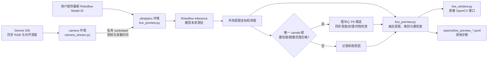
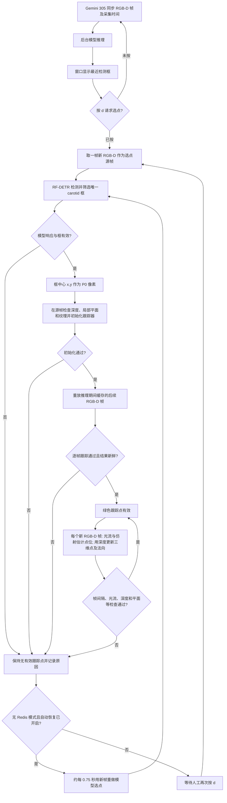

# Carotid_begin 架构

## 当前目标

用户在 Roboflow 训练 Object Detection 模型并提供完整 Model ID。
本项目用腕部 Gemini 305 的实时同步 RGB-D 完成检测框预览、从框中心选取
初始扫描点 P0、逐帧跟踪，以及丢失后的模型重选。本地窗口可观察整个过程；
`--no-redis` 模式不向 Robot 发送控制请求。模型给出的 P0 是视觉候选，
不等同于独立确认的真实位置。

## 检测预览数据流

`camera_stream.py` 在已有 `camera` 环境使用 Orbbec SDK。
`live_preview.py` 在 `ultralytics` 环境加载私有模型；当前 RF-DETR 使用
ONNX Runtime 的 `CUDAExecutionProvider`。输入和后处理张量留在 CPU，
以免 Roboflow 的 GPU 张量路径额外依赖 PyCUDA；模型的 ONNX 计算在 GPU 会话执行。
启动时检查真实模型会话的 provider，CUDA 未启用则直接报错。
两个进程仅经本机私有 socket 传帧。显示用独立窗口进程，
避免模型推理与 OpenCV 窗口事件循环互相阻塞。API Key 从本机私有凭据文件读取，
不写进命令或报告。

## 检测、选点与跟踪

下面是 `click_follow.py --model-id ... --no-redis` 的状态流程。单独运行
`live_preview.py` 只执行检测和候选点预览，不会进入选点或跟踪状态。

1. **检测与选点不同。** 模型持续处理相机帧，窗口显示最近 500 ms 内的框；
   这些框只是预览。按 `d` 后，程序另取一帧新鲜的同步 RGB-D 作为选点源帧，
   检查响应尺寸、采集帧标识、类别、置信度、框坐标和目标唯一性。Roboflow
   检测结果的 `x, y` 本身就是框中心，故 `P0=(x,y)`，不是框底部或人为偏移点。
   若无合格框或合格框不唯一，保持无有效跟踪点。默认模型出框阈值为 0.4；
   宽松模式的选点框阈值为 0.25，但低于 0.4 的框不会由模型返回。
2. **源帧初始化与赶帧。** `LocalTracker.initialize` 在检测所用的**同一源帧**上，
   用 P0 像素及对齐深度反投影出相机坐标系三维点，在局部深度云拟合平面求法向，
   并提取周围纹理特征。模型推理期间的新 RGB-D 帧会缓存；推理返回后按采集顺序
   调用 `LocalTracker.update` 重放这些帧，把 P0 从源帧追到当前帧。缓存溢出、
   某帧跟踪失败或结果超过 200 ms 时不确认选点；已追上但结果暂不够新鲜时，
   最多继续等待约 2 秒的新帧。失败原因写入诊断日志。
3. **连续跟踪。** 有效选点后，不再用每个新框中心替换跟踪点。
   跟踪器在每帧用局部特征的前后向光流和 RANSAC 仿射变换更新二维点，
   再以当前帧对齐深度求三维位置与局部平面法向；帧间隔、特征数、跳变、
   深度和平面质量等检查不通过即锁定为丢失。故绿色点可以与最新的橙色框中心
   略有差异：框代表最近一次模型检测，绿色点代表连续跟踪结果。
4. **显示平滑。** 仅在 `--no-redis` 窗口中，绿色点和 `p(m)` 文本对有效
   跟踪结果使用约 120 ms 时间常数平滑；运动超过 6 px 时加快响应。
   新目标或跟踪丢失时重置平滑器。平滑后的值不参与跟踪质量判断，
   也不作为发送给 Robot 的观测。
5. **丢失与恢复。** 无 Redis 模式首次按 `d` 后开启自动恢复。跟踪失效时
   不继续显示有效绿色点，约每 0.75 秒从**新相机帧**重新检测并按上述完整
   初始化、赶帧流程恢复；旧框不能直接充当恢复结果。若没有合格框或几何检查
   失败，继续保持丢失并稍后重试。按 `p` 停止自动恢复并清除当前点；
   再按 `d` 可重新开启。连接 Robot 的模式不自动恢复，丢失后需要人工重新选点；
   视觉门槛变化不改变 Robot 的运动、力和故障保护。

实现入口：[`detection.py`](detection.py) 负责框中心筛选，
[`model_worker.py`](model_worker.py) 执行模型推理，
[`model_selection.py`](../Camera_wrist/model_selection.py) 负责源帧与赶帧，
[`local_tracker.py`](../Camera_wrist/local_tracker.py) 负责逐帧跟踪与显示平滑，
[`click_follow.py`](../Camera_wrist/click_follow.py) 管理窗口、按键和恢复状态。

## 画面语义与边界

- **所有模型返回的框**均叠加在原图上，附类别与置信度；低置信度或类别不符的框
  用灰色显示，满足类别和置信度但未成为有效 P0 的框用橙色显示。
- 标准模式要求唯一 `carotid` 框、置信度至少 0.5、框坐标在原图范围内，
  且同步深度、纹理和结果时效检查通过时，框与 P0 十字显示为绿色。
  P0 使用框中心原图像素；**没有固定 40 px 图像边距**。
- 只读预览默认使用宽松视觉门槛；腕部按 `d` 模型选点时，只有
  `--no-redis` 模式默认宽松。可用 `--standard-vision` 显式恢复标准视觉门槛。
  连接 Robot 的模式始终使用标准视觉门槛。
- 相机采集年龄超过 200 ms 时 P0 候选标为 `STALE`；
  框仍可显示用于诊断。`REJECTED` 也不隐藏原始检测框。
- 预览窗口按 `q`/Esc 退出；逐帧预测只写入诊断日志，不能作为 P0 真值。
- 腕部窗口中，橙色框是最近一次有效期内的模型预览；绿色点是当前连续跟踪结果，
  两者的时刻和位置可能不同。完整的选点、赶帧和平滑恢复过程见上节。
- 实时预览只验证检测和同帧几何；连续跟踪需要在腕部窗口另行验证，
  Robot 运动需要在连接 Robot 的模式单独验证。

## 视觉质量模式

| 检查 | 标准 | 宽松（只读默认） |
| --- | ---: | ---: |
| 模型出框置信度 | 0.4（显式传入） | 0.4（显式传入） |
| 选点框置信度 | 0.5 | 0.25 |
| 邻点深度差 | ≤5 mm | ≤8 mm |
| 局部平面点数 / 内点比例 | ≥50 / ≥0.70 | ≥35 / ≥0.55 |
| 平面内点距离 / RMS / P0 到平面 | ≤3 / 2 / 3 mm | ≤4 / 3.5 / 4.5 mm |
| 初始化纹理特征 | ≥12 | ≥8 |
| 跟踪前后向误差 / 仿射内点比例 | ≤1 px / ≥0.60 | ≤1.5 px / ≥0.50 |
| 跟踪像素 / 三维跳变 | ≤15 px / ≤10 mm | ≤20 px / ≤15 mm |

宽松模式还放宽局部平面非共线度、跟踪仿射尺度、RANSAC 重投影误差和行列式范围。
两种模式都要求模型响应尺寸匹配、唯一有效目标、P0 有正深度、观测与采集帧一致，
并保留 200 ms 时效检查。无效跟踪不会被当作有效观测；仅无 Redis
验证模式在首次按 `d` 后自动尝试模型重选，连接 Robot 时仍需人工恢复。
Robot 侧几何、运动、力和故障门槛完全不受宽松模式影响。

运行命令与当前实测状态见 [PROGRESS.md](PROGRESS.md)。
