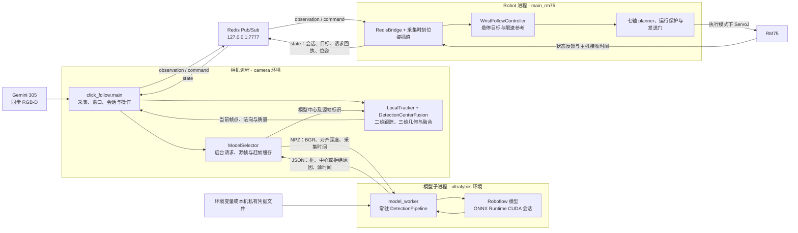
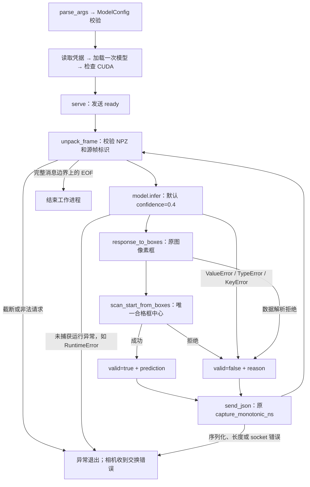
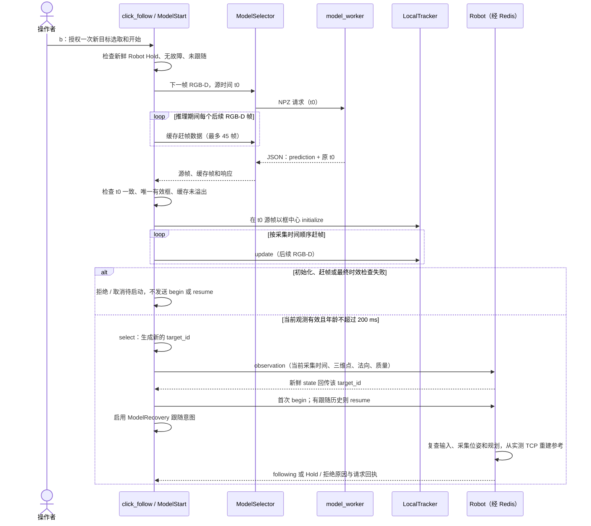
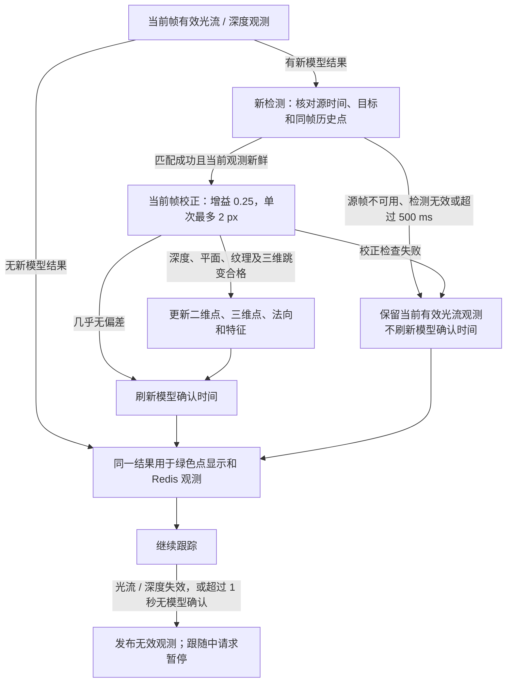
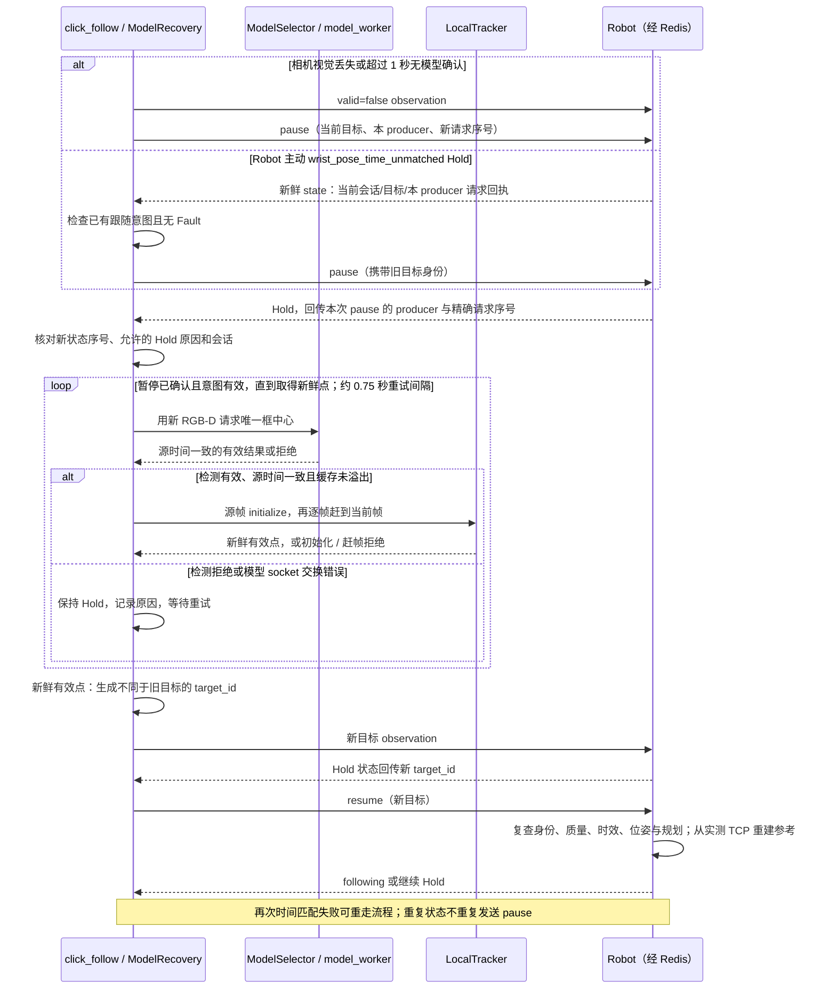

# Carotid_begin 架构

本文面向维护模型服务、腕部视觉和 Robot 接口的开发者，依据 **2026-10-02 当前工作区源码**。
`Carotid_begin` 将 Roboflow 目标检测框中心作为初始扫描点 P0 的视觉候选；
`Camera_wrist` 在同步 RGB-D 上生成、跟踪和融合三维观测；Robot 完成坐标转换、参考生成和运动控制。
模型候选通过程序门限，不等同于独立确认的真实扫描位置。

## 1. 实现范围与状态

“已实现”表示当前源码中有该路径；“待验收”表示路径已存在但验证证据不足；
“规划”表示后续工作，不构成当前接口或运行能力。下文架构图和时序图均描述已实现路径，
规划单列于第 9 节，不混入运行链路。

| 能力 | 状态 | 当前边界 / 依据 |
| --- | --- | --- |
| 本机常驻模型服务、CUDA 会话检查、唯一框中心输出 | 已实现 | `model_worker`、`gpu_model`、`DetectionPipeline`；默认类别 `carotid` |
| 同源帧初始化、缓存赶帧、光流跟踪、检测中心限幅融合 | 已实现 | `ModelSelector`、`replay_selection`、`LocalTracker`、`DetectionCenterFusion` |
| 模型模式 `b` 新帧选点后请求开始，`d` 只选点 | 已实现 | `ModelStart`；等待 Robot 回传新目标 ID 后请求 `begin/resume` |
| 视觉丢失后的暂停确认、自动重选和恢复 | 已实现 / 真机待验收 | `ModelRecovery`；Robot 主动 Hold 仅 `wrist_pose_time_unmatched` 接入此自动入口 |
| Redis 腕部协议、50 mm 悬停目标、七轴规划和发送链 | 已实现 / 模型驱动真机闭环待验收 | 复用 Robot 的 `click_follow` 模式，模型服务不发送机器人命令 |
| 独立 P0 真值、冻结测试集、动态三维定位与跟随精度评估 | 规划 / 待验证 | 检测结果、合成平移和无目标画面运行不能替代这些证据 |
| 模型定位后接触人体并进入超声力控扫描 | 规划，未在此链路实现 | 当前专用 Robot 启动脚本为无力、非接触腕部候选试验 |

当前相机入口始终连接 Redis，使用标准视觉门槛；`--no-redis` 和 `--standard-vision`
已不在 `click_follow.py` 的 CLI 中。原独立预览的 `camera_stream.py`、`live_preview.py`、
`live_window.py` 等文件已移除，不能作为当前启动入口。最简启动命令见本机
[启动 notebook](../../.runme/run/carotid-begin-operations.md)，历史证据见
[进展 notebook](../../.runme/Progress/carotid-begin-progress.md)。`.runme/` 不纳入 Git；
跨模块变更原因见 [DECISIONS.md](../../DECISIONS.md)。

## 2. 系统架构与职责

本机分为相机 Python 进程、模型 Python 子进程、Redis 和 Robot C++ 进程。
模型进程由相机启动，经继承的私有 `socketpair` 通信，没有独立 TCP 服务端口。
模型请求交换在相机后台线程执行；采集、跟踪、状态处理和 OpenCV 窗口事件由相机主循环管理。



| 模块 / 源码入口 | 已实现职责 | 输出 / 权限边界 |
| --- | --- | --- |
| [config.py](config.py) · `ModelConfig` | 不可变配置；校验 ID、类别、两个置信度和边距 | 在凭据读取和模型加载前拒绝非法配置 |
| [credentials.py](credentials.py) · `get_api_key` | 优先读 `ROBOFLOW_API_KEY`，否则读本机私有文件 | 密钥不进入帧协议、Redis 或日志 |
| [gpu_model.py](gpu_model.py) · `load_cuda_model` | 加载模型并检查可用 provider 和实际模型会话 | 必须包含 `CUDAExecutionProvider` |
| [detection.py](detection.py) · `response_to_boxes`、`scan_start_from_boxes` | 原生响应转原图检测框；选择唯一合格目标中心 | 输出二维 `scan_start`，不做深度反投影 |
| [pipeline.py](pipeline.py) · `DetectionPipeline.process` | 注入模型、单帧推理、框转换、选点和响应组装 | 不包含凭据、socket、深度几何或 Robot 操作 |
| [live_protocol.py](live_protocol.py) | RGB-D 校验、NPZ 编解码和有长度上限的 JSON 发送 | 保留源采集时间，禁用 pickle 和非有限 JSON 数值 |
| [model_worker.py](model_worker.py) · `main`、`serve` | CLI、模型加载一次、ready 握手、顺序处理请求 | 仅响应相机；关闭时释放 socket |
| [model_selection.py](../Camera_wrist/model_selection.py) | 子进程生命周期、单请求交换、选点赶帧、检测源帧对齐 | 不发布 Redis 命令；工作进程退出后不自动重建 |
| [local_tracker.py](../Camera_wrist/local_tracker.py) | LK 光流、RANSAC 仿射、局部表面与法向、限幅校正 | 质量失败锁存丢失；重新 `initialize` 才能恢复 |
| [click_follow.py](../Camera_wrist/click_follow.py) | 采集、窗口、`ClickSession`、`ModelStart`、`ModelRecovery` | 生成观测和操作请求，不能直接驱动机械臂 |
| [redis_bridge.cpp](../Robot/src/redis_bridge.cpp)、[main_rm75.cpp](../Robot/src/main_rm75.cpp) | 协议校验、反馈历史、坐标转换、状态回传与控制调度 | Robot 独占规划和机器人发送链 |
| [rm75_control.cpp](../Robot/src/rm75_control.cpp) · `WristFollowController` | 50 mm 目标、连续姿态和限速参考 | 成功开始/恢复时重建参考，计划提交后推进参考 |

凭据文件为 `~/.config/carotid_begin/roboflow_api_key`；读取时要求普通文件且没有组/其他用户权限，
保存工具写入权限 `0600`。模型默认缓存为 `Carotid_begin/data/model_cache/`，可由
`MODEL_CACHE_DIR` 覆盖。`gpu_model` 使用 `device='cpu'` 输入路径避免额外 PyCUDA 依赖，
ONNX 会话同时配置 CUDA 和 CPU provider；检查保证 CUDA 已启用，不证明每个算子都在 GPU 执行。

## 3. 模型服务数据流与协议

入口为 `python -m infer.Carotid_begin.model_worker`，`ModelSelector` 传入
`--socket-fd`、`--model-id` 等参数。相机默认选择 `ultralytics` 环境的 Python，
也可用 `--detector-python` 指定；初始化时装配 CUDA/cuDNN 和可用的 MKL 库路径。



所有消息采用 **4 字节网络字节序无符号长度 + 正文**。工作进程串行处理；
相机 `pending` 时不接受第二个请求，后台交换不会形成多帧推理队列。

| 消息 | 编码 / 长度上限 | 字段与语义 |
| --- | --- | --- |
| 帧请求 | NumPy NPZ，正文 ≤16 MiB，`allow_pickle=False` | `image`：非空 `uint8 H×W×3` BGR；`depth`：同尺寸 `float32 H×W`；`meta`：JSON 对象，含非负整数 `capture_monotonic_ns` |
| ready | UTF-8 JSON，正文 ≤4096 字节 | `{"ready":true,"model_id":"…"}`；相机要求与启动 ID 完全匹配 |
| 逐帧结果公共部分 | UTF-8 JSON，正文 ≤65536 字节 | `valid`、原始 `capture_monotonic_ns`；相机再次检查与请求源帧相等 |
| 有效选点结果 | 同上 | `prediction` 含 `scan_start:[x,y]`、`confidence`、`box_xyxy`、`class_name` |
| 检测拒绝结果 | 同上 | `valid:false`、`reason`；普通拒绝后继续接收下一帧 |
| 预览附加字段 | 原生框转换成功后才存在 | `detections`、`image_size:[W,H]`、`inference_ms`；无合格框或多候选也可带这些字段 |

深度随请求传输，但 `DetectionPipeline` 只消费 BGR；协议层检查深度类型和形状，
有效深度、表面和平面检查在相机跟踪端执行。`inference_ms` 仅计 `model.infer`，
不含帧传输、后处理、赶帧或端到端延迟。管线捕获 `ValueError/TypeError/KeyError`
并拒绝当前帧；其他异常向上抛出。启动失败、传输损坏和工作进程故障不能视为“无目标”。
ready 等待超时为 60 秒，逐帧交换超时为 15 秒；两者均不是观测有效期。

启动时模型加载或 ready 握手失败，会使相机启动失败。运行时 `ModelSelector.poll`
将交换错误交回主循环：选点中的错误拒绝本次选点；预览中的错误先记录，已有有效光流可继续，
但不会刷新模型确认时间，后续跟踪失效或超过 1 秒无确认时进入视觉丢失路径。
视觉丢失时按已有会话和目标发布无效观测，若仍处于跟随请求状态则发送暂停请求；
不能将“模型错误已记录”视为 Robot 已暂停。当前没有工作进程重启机制，重建模型服务需退出并重新启动相机入口，
步骤见 [启动 notebook](../../.runme/run/carotid-begin-operations.md)。

选点默认配置如下；相机 `--model-confidence` 可修改选点阈值，当前调用固定推理阈值 0.4 和边距 0。

| 配置 / 检查 | 默认规则 | 源码 |
| --- | --- | --- |
| 类别 | 精确匹配 `carotid`；可用 `--model-class` 修改 | `ModelConfig`、`scan_start_from_boxes` |
| 模型出框 / 选点置信度 | 默认均为 0.4；选点阈值可独立修改 | `DetectionPipeline.process`、`click_follow.main` |
| 原图坐标 | 响应图像尺寸等于输入；框宽高为正，合格候选框不越原图边界 | `detection.py` |
| 唯一性 | 按类别和置信度过滤后恰好 1 个候选；不是从多个候选取最高分 | `scan_start_from_boxes` |
| P0 与边距 | `P0=(x,y)` 为框中心；默认额外边距 0 px，无固定 40 px 门槛 | `scan_start_from_boxes`、`LocalTracker._features` |

## 4. 新目标选取与单键开始时序

模型模式持续做后台预览；预览完成且距上次请求至少 0.1 秒时可请求下一帧，
不是保证 10 Hz。`b/d` 另请求一帧新的 RGB-D，不把窗口里的旧框直接作为初始化结果。
若已有预览在途，先完成该请求，再开始选点。



源帧上先检查纹理与同帧深度，再逐帧重放。没有后续帧、缓冲溢出、某帧跟踪失败均拒绝。
赶帧结果暂时超过 200 ms 时可继续等待新帧，最多 2 秒；仍不够新鲜则取消。
Robot 回传新 `target_id` 表示新观测身份已进入状态，不能当作运动或规划成功确认；
发出 `begin/resume` 后 Robot 仍可拒绝。相机 `session.following` 是请求侧状态，
窗口应以 Robot 的 `follow_state/control_state` 判断实际控制阶段。

| 操作 | 当前模型模式行为 |
| --- | --- |
| `b` | 需要新鲜 Robot Hold；清除旧跟踪，选新点，目标回传后请求 `begin/resume`；重复 `b` 不排队 |
| `d` | 取消待启动；接受新的只选点操作时取消自动恢复意图；跟随中需先暂停，不能直接换目标 |
| `r` | 对已经选好的新鲜目标请求 `resume`；需要已有开始历史，不执行一次新的模型选点 |
| `p` | 请求 `pause`，取消待启动和自动恢复，清除跟踪与目标 |
| `q` | 请求 `end` 并退出相机；Robot 保持 Hold 或进入通信超时处理，不退出 Robot |

选点失败、观测过期、Robot 状态超时、重启、故障或通信错误取消 `ModelStart`，失败后需再次按 `b`。
不传 `--model-id` 时保留鼠标选点模式，仍连接 Redis；模型模式禁用鼠标选点。

## 5. 连续跟踪与异步检测融合

每个同步 RGB-D 帧先由 `LocalTracker.update` 更新二维点，再用对齐深度和当前彩色内参
求三维点与外法向。有效新模型响应到达时，用 `DetectionCenterFusion` 中同一目标的
**检测源帧跟踪点**消除时间错位，再在当前帧做小步校正：

```text
aligned_center(t_now) = tracked_pixel(t_now)
                      + detected_center(t_source) - tracked_pixel(t_source)
delta                 = aligned_center(t_now) - tracked_pixel(t_now)
correction            = delta × min(0.25, 2 px / ||delta||)
```

偏差几乎为零时返回 `already aligned`，不计算上式的除法。
这是将源帧偏差平移到当前点，不是把旧框当作当前帧的新检测，也不是完整的运动预测。



历史最多保留 60 个跟踪帧，按 `capture_monotonic_ns` 精确匹配；换目标或丢失时清空。
当前代码没有“模型中心距光流点超过 15 px 即拒绝”的门槛；**15 px/帧仍是光流自身的跳变门槛**。
校正失败不修改光流状态，也不算模型确认；校正成功或 `already aligned` 才刷新确认时间。
1 秒门限从最近一次成功选点/模型确认的主机单调时刻计算。

窗口显示最近 500 ms 内、尺寸匹配的全部可绘制检测框，均为橙色并标类别/置信度；
绿色点表示当前有效跟踪或融合结果，两者可能来自不同时刻、位置不同。
当前 `click_follow` 显示和发布同一融合结果，没有调用 `DisplayPointSmoother`；
该类虽仍在跟踪模块中，但不在当前入口数据流中。

## 6. 暂停确认与自动恢复时序

自动恢复只在模型模式首次人工 `b/r` 发出开始/恢复请求后启用。
相机视觉失效会主动发布无效观测并发送 `pause`；Robot 主动触发的
`wrist_pose_time_unmatched` 也可进入同一路径，但须是同一运行会话、当前目标、
本 producer 的请求回执且无 Fault，不能将任意 Robot Hold 当作恢复授权。



暂停回执须来自当前 Robot 会话、`request_producer_id` 等于本进程，
`request_sequence` **等于**本次暂停序号，状态序号晚于发送暂停前的状态。
允许的原因集合为 `operator_pause`、`operator_paused`、`invalid wrist observation`、
`wrist_pose_time_unmatched`、`wrist_observation_missing_stale_or_mismatched`。
`operator_paused` 可以是本流程自动暂停的结果；人工 `p` 会取消恢复，不能据此自动启动。

重选无点期间保持 Hold；新观测有效、目标 ID 改变并获 Robot 回传后才发 `resume`。
约 0.75 秒是重试间隔，模型在途、赶帧和回执等待会增加恢复耗时，不保证在 0.75 秒内恢复。
人工 `p/q`、接受新的只选点操作 `d`、会话改变、状态超时、Fault、Redis 发布或 Robot 状态通信异常、非视觉拒绝或其他 producer 的
冲突回执会取消自动意图。持续时间匹配失败可以反复重试并保持 Hold，不保证恢复成功。
模型私有 socket 交换错误拒绝本次选点，但不直接取消已有恢复意图；它与上面的 Redis / Robot
状态通信异常不同。模型工作进程故障不会自动重启，后续重选重试也不会重建该进程。

## 7. Redis 数据契约与时间 / 质量约束

腕部链路复用 `127.0.0.1:7777` 的 Pub/Sub，默认不需要全局相机、数字人或 seed。
启动顺序为 Redis → 相机 → Robot；相机和 Robot 启动脚本均不会启动 Redis。
仅连上 Redis 或收到 Robot 状态不会触发运动，仍需操作请求。

| 通道 | 方向 | 数据用途 |
| --- | --- | --- |
| `robot:wrist:state:v1` | Robot → 相机 | `scope=click_follow`；会话、标定摘要、反馈位姿、控制状态、目标 ID 和请求回执 |
| `robot:wrist:observation:v1` | 相机 → Robot | 当前帧三维点、外法向、真实几何/特征质量及采集时间；失效时 `valid=false` |
| `robot:wrist:command:v1` | 相机 → Robot | `action=begin/resume/pause/end/heartbeat`；约每 100 ms 在跟随或等待恢复期间发心跳 |

观测/命令公共字段为 `version=1`、`runtime_session_id`、`producer_id`、`target_id`、
`sequence`、`timestamp_monotonic_ns`、`boot_id`、`calibration_sha256`、
`frame=gemini305_color_optical`、`length_unit=m`。
`producer_id` 每相机进程生成，`target_id` 每次成功选点生成，序号由相机统一递增，
Robot 按 producer 和通道校验。标定 SHA-256 按文件原始字节计算。

有效观测另含 `capture_monotonic_ns`、`pixel`、`point_camera_m`、`normal_out_camera` 和
`quality={surface_points,feature_inliers,plane_rms_m,plane_inlier_ratio,...}`；
Robot 要求有限点、`z>0`、近单位法向且 `normal·point<0`。
相机对同一目标的同一有效采集帧只发布一次；Robot 拒绝重复/乱序消息及有效观测采集时间回退。
无效观测携带 `reason`，不继续使用坐标。完整字段见
[腕部协议](../Camera_wrist/ARCHITECTURE.md#redis-接口)和 `RedisBridge::ParseWristPacket`。

| 时间 / 缓存检查 | 当前数值 | 检查位置与含义 |
| --- | --- | --- |
| SDK 采集时钟映射 | 30 帧预热；时钟采样跨度 ≤1 ms，偏移变化 ≤2 ms | [CaptureClock](../Camera_wrist/projection_preview.py)；不以接收时间代替采集时间 |
| 彩色 / 深度采集时间差 | ≤20 ms | `click_follow.main`；要求同步对齐 RGB-D |
| 请求帧、当前观测、Robot 状态年龄 | 各自 0～200 ms | `ModelSelector.request`、`observation_is_fresh`、`ClickSession`；基于同机单调时钟 |
| 跟踪帧间采集间隔 | 严格递增，≤200 ms | `LocalTracker.update` |
| 选点后续帧缓存 / 额外赶帧等待 | 最多 45 帧 / 最多 2 秒 | `ModelSelector`、`click_follow.main`；溢出拒绝，不静默跳帧 |
| 检测预览与融合的源帧年龄 / 融合历史 | ≤500 ms / 最多 60 帧 | `draw_detection_boxes`、`DetectionCenterFusion`；不放宽当前观测的 200 ms 门限 |
| 模型确认缺失 | 超过 1 秒丢失 | `click_follow.main`；不是单次模型推理超时 |
| Redis 消息年龄 / 命令有效期 | ≤500 ms | `ParseWristPacket`、`main_rm75`；心跳只续命令，不刷新采集年龄 |
| Robot 位姿插值跨度 | ≤50 ms，须包围采集时间，不外推 | [CalibratedFrameChain::InterpolateCamera](../Robot/src/calibrated_frame_chain.cpp)；平移线性、旋转 SLERP |

| 标准视觉检查 | 当前门限 | 源码 |
| --- | --- | --- |
| 纹理区域 / 特征数 | 最多 80×80 px，边缘裁切；≥12 个特征 | `LocalTracker._features` |
| LK / 仿射 | 前后向误差 ≤1 px；内点比例 ≥0.60；尺度 0.9～1.1；行列式 0.81～1.21；RANSAC 重投影阈值 1 px | `LocalTracker.update` |
| 光流像素 / 三维跳变 | ≤15 px/帧 / ≤10 mm/帧 | `LocalTracker.update`；融合另查三维跳变 |
| 深度邻域 / 邻点差 | 15 mm 三维邻域；邻点差 <5 mm，拒绝孔洞和深度边缘 | `surface` |
| 平面支持 | ≥50 点；内点比例 ≥0.70；非共线展开量 ≥2 mm | `surface` |
| 平面误差 | 内点距离 ≤3 mm；RMS ≤2 mm；目标到平面 ≤3 mm | `surface` |
| Robot 复查质量 | `feature_inliers≥12`、`surface_points≥50`、`plane_rms_m≤0.002`、`plane_inlier_ratio≥0.7` | `RedisBridge::ParseWristPacket` |

`RELAXED` 常量仍在跟踪模块内，但当前 `click_follow` 构造 `LocalTracker()`，没有宽松模式 CLI。
质量字段来自跟踪器实际计算，不用模型置信度替换几何或特征质量。
Robot 时间历史基于主机收到反馈的时刻，状态标记
`pose_time_basis=host_feedback_receive_not_controller_sample`；它不是控制器真实采样时刻，
上述代码门限不能证明曝光误差或反馈传输延迟已经独立量测。

## 8. Robot 坐标、参考与运行边界

采用列向量，`T_A_B` 将 B 系坐标映射到 A 系。Robot 在当前观测的采集时刻 `t`
插值相机位姿，位置以米计：

```text
T_base_camera(t) = T_base_armtip(t) × T_armtip_camera
p_surface_base  = R_base_camera(t) × p_camera + t_base_camera(t)
n_out_base      = R_base_camera(t) × n_out_camera
p_tcp_goal      = p_surface_base + 0.050 × n_out_base
Tool-Z 候选     = -n_out_base
```

Tool-X 取上一参考 X 轴在新切平面的投影，退化则 Hold。候选目标旋转与上次接受的目标旋转
相差不超过 **5°** 时沿用该目标；这是旋转死区，不是单独比较法向夹角。
位置仍沿原始有效法向偏置 50 mm。开始/恢复时从实测 TCP 和关节重建参考，
后续成功提交计划才推进参考；TCP 位置参考限速 **2 mm/s**，姿态参考限速 **2°/s**。
腕部 ServoJ 规划另对每个关节设置 **2°/s** 的命令步长上限，普通超声模式
不使用这项额外上限。这些数值约束参考与下发目标，不保证机械臂实测瞬时
速度、探头物理净空或独立定位精度。

[start_robot.sh](../Camera_wrist/start_robot.sh) 是当前专用候选试验入口，显式使用
`--execute-wrist-follow --confirm-wrist-follow --wrist-no-force --wrist-candidate-trial`，
`--duration-sec 0` 持续运行直至停止或故障，并通过以下参数改变试验保护配置：

| 参数 | 当前脚本行为 |
| --- | --- |
| `--wrist-no-force` | 不采集力、不 tare、不执行力闭环；仍使用标定文件的 TCP 几何 |
| `--wrist-unlimited-excursion` | 关闭实际与规划 TCP 距起点的累计位移、累计转角检查 |
| `--wrist-unlimited-position-tracking-error` | 关闭腕部实测 TCP 与规划模型间的 50 mm 位置误差检查 |

关节、规划、通信及故障保护继续由 Robot 管理。外参文件
[gemini305_to_rm75_armtip.json](../Camera_wrist/gemini305_to_rm75_armtip.json)
仍为 `independent_validation_recorded=false`；候选试验不等于外参已独立验收。
此入口仅对应探头不接触人体的空中跟随；50 mm 为计算目标与估计表面的法向间距，
不能当作实测物理净空。Hold 也不等同于断电或已确认实体静止；停止链路见
[Robot 架构](../Robot/ARCHITECTURE.md)。

## 9. 规划、验证证据与维护入口

| 后续事项 | 当前状态 | 完成所需证据 |
| --- | --- | --- |
| P0 标签、冻结测试集和定位精度评估 | 规划 / 未形成独立验收结论 | 专家复核或独立测量真值、按对象/会话分组的像素及三维误差、法向误差和错选统计 |
| 新单键开始、融合与自动恢复的真实目标闭环 | 已实现、待验收 | 同步相机/Robot 日志；遮挡、丢失、重复恢复、重启和停止等真实场景记录 |
| 外参、TCP 几何和时序误差独立复核 | 待验收 | 多姿态同点 Base 一致性、实际 TCP 间距、采集/反馈延迟测量 |
| 模型驱动接触与超声扫描衔接 | 规划，当前链路未实现 | 明确交接状态、力控接入及成像质量验证；当前无力脚本不能提供这些能力 |

历史 YOLO-Pose、单点标注/导出工具和独立预览记录不构成当前模型服务 API；
当前使用 Object Detection 框中心，而非关键点模型输出。新增能力前应重新核对源码，
不能从旧计划推断文件或接口仍存在。

| 检查 / 证据入口 | 可验证的范围 | 不能据此宣称 |
| --- | --- | --- |
| [Carotid_begin tests](tests/test_model_worker.py)、[检测与协议测试](tests/test_detection_protocol.py) | 假模型下的配置、框转换、消息边界、多帧服务、源时间和异常处理 | 真实 CUDA 会话、检测准确率或设备运行已通过 |
| [模型选点测试](../Camera_wrist/tests/test_model_selection.py)、[跟踪测试](../Camera_wrist/tests/test_tracker.py) | 合成 RGB-D 上的赶帧、同源帧融合、2 px 校正上限与丢失锁存 | 真实人体运动精度或动态稳定性已验收 |
| [单键开始测试](../Camera_wrist/tests/test_model_start.py)、[会话与恢复测试](../Camera_wrist/tests/test_click_session.py) | 选点后目标回传、暂停回执、身份、时效及取消条件 | 真实 Redis / Robot 或机械臂运动已经执行 |
| [模拟回环入口](../Camera_wrist/tests/loopback_check.py) | 隔离 Redis 和模拟 Robot 的端到端交互 | 真机视觉跟随效果 |
| [进展 notebook](../../.runme/Progress/carotid-begin-progress.md) | 带日期的离线、GPU、只读硬件和试验历史 | 历史通过数等于当前完整回归结果 |

进度记录中的真实 RGB-D 初始化、单步模型融合和无目标只读运行，覆盖各自执行范围；
没有独立 P0 真值，不能用于定位精度结论。存档图像的合成平移曾出现连续两帧超过 15 px
的模型中心跳变；当前每次最多校正 2 px，仍需真实目标与真值检验长期偏移和错选。
本次架构文档更新不新增 GPU、相机、Redis 回环或真机运动验收证据。

| 日志 | 定位用途 |
| --- | --- |
| `Camera_wrist/log/wrist_click_*.jsonl` | `model_detection_requested`、`model_replay`、`model_selection`、`model_start`、`model_preview`、`model_fusion`、`model_recovery_wait`、`model_auto_resume` 及 Redis 输入/输出错误 |
| 同名 `.tracking/` 目录 | [TrackingDiagnostics](../Camera_wrist/tracking_diagnostics.py) 保存失效事件与图像证据 |
| `Camera_wrist/log/wrist_continuous_*/runtime.csv.wrist.csv` | 采集年龄、位姿插值跨度、点/法向、间距和规划结果 |
| 同目录 `runtime.csv`、`runtime.summary.json` | 实测/参考/规划状态、故障、有效配置及最终停止结果 |

排查按同机单调时间、运行会话、producer、target 和请求序号关联两端记录。
`model_fusion.applied=false` 需结合 `reason` 和确认状态解释；“已经对齐”与“校正失败”不同。
相机超时可能是 Robot 先发生 Fault 的结果，应查最早拒绝/故障原因。
最简启动步骤见本机 [启动 notebook](../../.runme/run/carotid-begin-operations.md)，相关边界见
[Camera_wrist 架构](../Camera_wrist/ARCHITECTURE.md)与[系统架构](../../ARCHITECTURE.md)。
