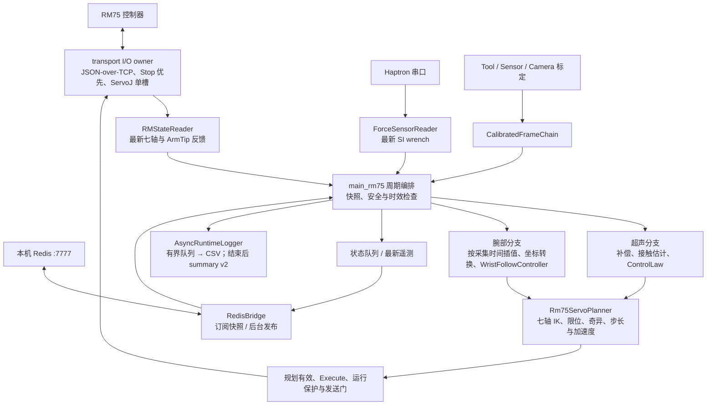
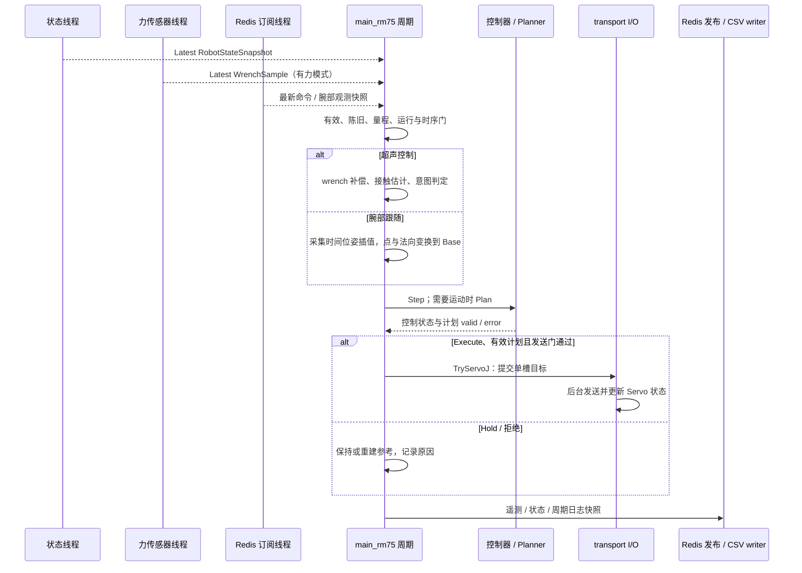
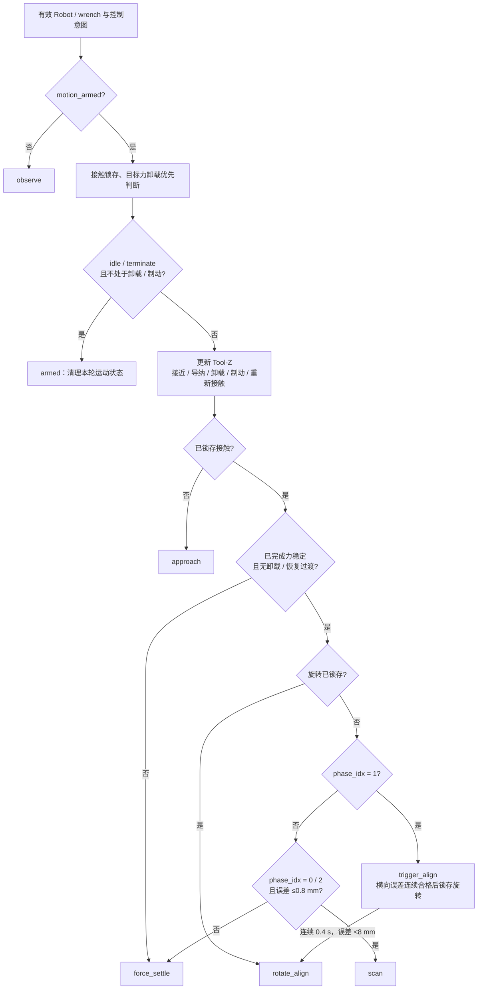
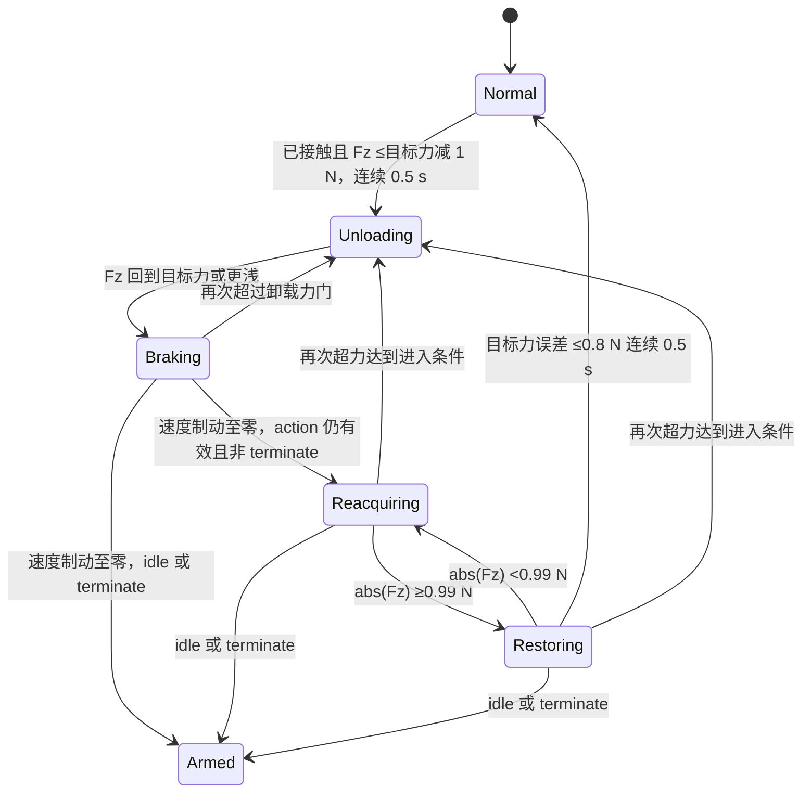
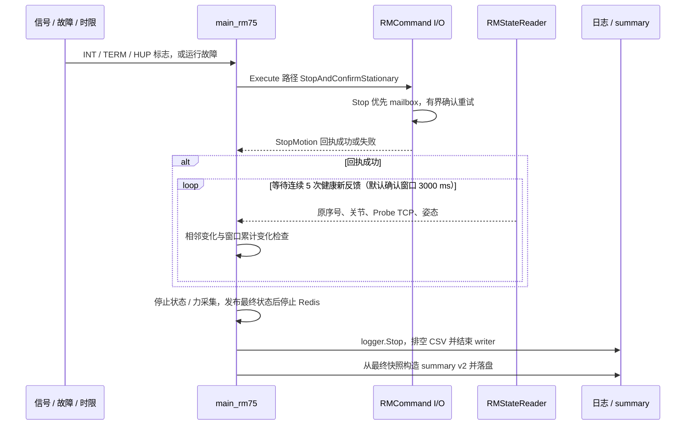

# RM75 控制服务架构

本文依据 **2026-10-02 当前工作区源码**，说明实际入口、线程边界、数据协议与停止路径。
Robot 装配七轴反馈、Haptron 力觉、标定、接触估计、Redis 视觉意图、控制律、规划和日志；
唯一生产可执行文件为 `main_rm75`。历史六轴源码不在当前 CMake 构建链中。

## 运行模式与实现边界

**无参数运行 `main_rm75` 会选择 Execute 生产 profile，可发送真实运动命令。**
`RobotRuntimeConfig` 的结构体默认值虽为 Observe，但入口在 `argc==1` 时调用
[MakeImplicitRm75ProductionConfig](src/rm75_runtime_config.cpp) 覆盖它，不能把两者混淆。

| 模式 / 路径 | 已实现行为 | 边界或待验收事项 |
| --- | --- | --- |
| 显式 `--observe` | 采集真实反馈、补偿 / 接触估计、发布和记录；不生成执行运动 | 仍连接所配置设备，除非使用模拟 |
| `--dry-run-control` | 真实反馈下运行控制与规划，记录目标；不发送 ServoJ | 规划有效不代表实体运动验证完成 |
| `--simulate` | 模拟反馈；设置 DryRun 并关闭 Redis | 后置 `--redis-enabled` 可重新启用真实 Redis，参数按顺序解析 |
| 无参数生产 profile | Execute、Redis 闭环、连续运行；接收有效新鲜命令后按 `action_state` 控制 | 视觉端首发 idle 是生产端约定，Robot 无独立“先 idle 后 moving”强制门；包含 provisional 力控配置 |
| 腕部 `--wrist-follow FILE` | 相机观测转换、50 mm 悬停、目标 / 请求回执、专用参考与 planner | Execute 需对应执行 / 确认参数；候选试验允许未独立验收外参 |
| 腕部投影预览 | Observe、全局与腕部外参、seed 与相机位姿发布 | `projection_preview_only`，不进行腕部跟随 |
| 离线 parser / 控制 / 规划 / schema 检查 | 已实现，见 [构建与验证](#构建与验证) | 不能代替力准确度、动态定位、实体净空与停止验收 |
| 接触超声与腕部无力悬停自动交接 | 当前未实现 | 规划扩展，不在当前入口状态机中 |

无参数 profile 当前固定 RM75 `192.168.50.254:8080`、FTDI by-id 串口
`DU0DU5LC`（115200 baud）、本机 Redis `127.0.0.1:7777`；标定文件从可执行文件目录
读取 `rm75_force_calibration.json`，Probe 模型为其相邻 `../model/Lprobe-IFS.STL`。
控制周期 10 ms、执行预热 2 s、无接触 tare 3 s、duration=0。
Redis `terminate` 结束一轮扫描并返回 Armed idle，进程继续等待下一轮；正在执行的目标力卸载先完成卸载 / 制动。
退出由停止信号、故障或配置时限触发。

## 系统架构与模块

实线表示已实现的数据通路。两个控制分支共用反馈、安全门、七轴 planner 和发送层；
腕部无力模式跳过力传感器、tare 与力闭环。



| 模块 / 源码 | 公共接口 | 职责与依赖 |
| --- | --- | --- |
| [realman_transport](src/realman_command.cpp) | `RMCommand`、`RMStateReader`、`RMResult`、`BestEffortStopGuard` | 连接、JSON framing、反馈快照、异步 ServoJ 与确认 Stop；Threads、nlohmann/json |
| [robot_sensor](src/force_sensor.cpp)、[contact_sensing](src/contact_sensing.cpp) | `ForceSensorReader`、`ForceCalibration`、`ContactLocation` | Modbus / legacy parser、SI 样本、重力 / tare 补偿、STL 接触估计；Threads、OpenSSL、Eigen |
| [rm75_motion](src/rm75_control.cpp)、[kinematics](src/realman_kinematics.cpp) | `Rm75ControlLaw`、`WristFollowController`、`Rm75ServoPlanner`、`RMKinematics` | 控制状态与参考；planner 负责 IK / 安全规划，kinematics 提供七轴 FK / 6×7 Jacobian；Eigen |
| [rm75_runtime_config](src/rm75_runtime_config.cpp) | `RobotRuntimeConfig`、profile 工厂、校验 | 配置装配及 `EffectiveSafety()` / `EffectivePlanner()`；依赖 motion |
| [rm75_frame_chain](src/calibrated_frame_chain.cpp) | `CalibratedFrameChain`、`StopAndConfirmStationary()` | 不可变坐标链、相机位姿插值和 Probe TCP 静止确认；transport、sensor、Eigen |
| [rm75_runtime_logging](src/rm75_runtime_logging.cpp) | `AsyncRuntimeLogger`、`RuntimeSummaryData` | 异步 CSV、summary v2 和终端结束报告；transport、sensor、motion |
| [RedisBridge](src/redis_bridge.cpp) | `LatestCommand()`、`LatestWrist()`、`PublishSensor()`、`PublishStatus()` | v1 / legacy 协议、重连、序号保护、腕部身份与异步发布；hiredis、nlohmann/json |
| [main_rm75](src/main_rm75.cpp) | 进程入口 | 参数校验、模块与线程生命周期、周期与最终快照、安全监督 |
| [arm_probe_pose](tests/tools/arm_probe_pose.cpp)、[arm_preset_pose](tests/tools/arm_preset_pose.cpp) | 维护 CLI | 单次定位及离线文件检查；不属于生产入口 |
| [tests/offline](tests/offline/) | CTest 可执行文件 | parser、配置、控制 / planner 拒绝、坐标链、日志契约；不访问设备 |

[CMakeLists.txt](CMakeLists.txt) 将 `redis_bridge.cpp` 直接编入 `main_rm75` 和相应测试；
控制与传感器静态库不反向依赖 Redis。使用 Linux / Bash、C++17、CMake ≥3.16、
Eigen ≥3.3、OpenSSL、Threads、hiredis；JSON 头文件来自仓库 include。

## 核心 API 与坐标契约

| 契约 | 调用方必须遵守的边界 |
| --- | --- |
| `RMCommand::Try*` → `RMResult` | 检查返回值；连接配置构造时注入，不修改私有 socket / mailbox / framing 状态 |
| `RMStateReader::Latest()` | 七轴关节 rad；ArmTip 位置 m、Euler 姿态 rad；保留原反馈序号与接收时刻 |
| `ForceSensorReader::LatestSample()` | `[Fx,Fy,Fz,Tx,Ty,Tz]`，N / N·m；用 `WrenchSample::IsStale()` 判陈旧；生产传感器串口只有一个 owner |
| `ForceCalibration::Compensate()` | 原始量程检查通过后补偿，输出 Sensor / Tool 表达；tare 不替代原始量程保护 |
| `ContactLocation::estimateContactPoint()` | 返回 `ContactEstimate.valid/error`；无接触、数值退化与残差失败不可压缩成有效零点 |
| `ControlLaw::Step()` / `WristFollowController::Step()` | 只产生参考 / 状态，不发送硬件命令；腕部 `Commit()` 仅在有效计划成功提交后推进参考 |
| `Rm75ServoPlanner::Plan()` | 必须 `valid=true` 才可提交；IK、阻尼、关节限位与奇异检查由 planner 统一执行 |
| `RedisBridge::EvaluateCommandForControl()` | 超声视觉意图进入控制层的失效拒绝门；连接状态与 payload 从同一快照读取 |
| `CalibratedFrameChain` | 从已校验标定构造，统一 Probe TCP、Tool-Y、Base←Tool/Sensor 与 Camera 变换；不在入口手工拼装重复矩阵 |
| `AsyncRuntimeLogger::PushAndMeasure()` | 提交周期记录，后台 writer 独占 CSV；summary 只在最终快照上构造 |

位置统一用 m、旋转矩阵采用列向量；`T_A_B` 将 B 中的坐标映射到 A。
生产反馈为 ArmTip，控制目标涉及 Probe TCP，二者通过标定链转换，不能混用。
`RMKinematics` 只提供七轴 FK / Jacobian 与限位读取，不能用历史六轴接口绕过 planner。

## 线程、周期与数据流



图示为稳态周期。控制线程不直接进行正常周期的 socket / 串口读写、Redis JSON 发布或 CSV 落盘；
启动、故障和退出阶段的确认停止允许等待反馈。`TryServoJ` 的成功只表示提交成功，
实际发送结果由异步 Servo 状态检查；不能据此宣称控制器执行完成。
反馈恢复时重建参考，并等待更新的生产者命令，不能继续旧意图。

| 缓冲 / 调度 | 当前实现 | 对数据流的影响 |
| --- | --- | --- |
| 状态 / 力 / Redis 输入 | 最新快照 | 周期可能跳过中间采样，不构成完整历史 |
| ServoJ | 单个待处理 mailbox，Stop 优先 | 限制排队；不是逐条无损执行队列 |
| Redis 状态输出 | 默认最多 32 条，满时丢最旧 | 状态事件可能被丢弃 |
| Redis sensor / wrist 遥测 | 单个待发布最新快照覆盖 | 限制背压，序列化在 publisher 中执行 |
| CSV 周期记录 | 8192 行队列，满时丢最旧并计 `DroppedRows()` | CSV 可能缺周期；summary 记录丢行数 |
| 控制周期 | Execute / 腕部要求 10 ms；非执行允许 10～100 ms | 请求周期不是实际反馈周期保证 |
| Robot 状态查询 | 普通超声 40 ms，腕部跟随 10 ms | 时间戳来自主机反馈接收，不是控制器采样时刻 |
| 陈旧默认值 | sensor 50 ms、Robot 200 ms、超声命令 500 ms | 来自 [runtime_config.hpp](include/rm75_runtime_config.hpp)，不是设备性能承诺 |
| 腕部观测 / 插值 | 采集年龄 ≤200 ms；相邻位姿跨度 ≤50 ms，不外推 | 心跳不刷新采集时间；不匹配则 Hold |

## 超声控制状态与力觉优先级

以下是 [Rm75ControlLaw::Step](src/rm75_control.cpp) 的已实现分支，适用于有力超声模式。
`phase_idx` 是视觉意图，不是 Robot 状态；状态还取决于接触锁存、力稳定和旋转锁存。
入口可另行覆盖为 Hold / Fault；腕部无力模式不经过这些分支。



| 状态 / 条件 | 当前参考行为与默认门限 | 锁存 / 边界 |
| --- | --- | --- |
| `armed` | idle 或 terminate，通常不生成扫描增量 | 卸载 / 制动尚未结束时推迟此分支；terminate 不退出 Redis 控制进程 |
| `approach` | 尚未锁存接触，请求 +Tool-Z 20 mm/s | `abs(Fz)≥0.99 N` 锁存接触；接触点估计有效位是另一项输入 |
| `force_settle` | 接触导纳；请求 Tool-Z 速度上限 2 mm/s | `abs(Fz)≥2 N` 且目标力误差 ≤0.8 N，连续 0.5 s 后锁存力稳定 |
| `scan` | phase 0 / 2、力稳定、视觉 Y 误差 ≤0.8 mm，请求 -Tool-X 10 mm/s | 默认累计扫描距离上限 0 表示连续；失去居中条件可回到 force_settle |
| `trigger_align` | phase 1、尚未旋转锁存；Tool-X 停止，继续居中 / 力控 | Y 误差 <8 mm 连续 0.4 s 后锁存旋转前 Tool-Y Base 方向 |
| `rotate_align` | 旋转锁存后按视觉 RZ 修正；默认 RZ 5°/s、累计额度 120° | 额度耗尽只停止 RZ；后续 phase 0 / 2 不自动解除旋转锁存 |
| `recovery_mode` | 已旋转锁存且 phase 2 时，暂停 X / RZ / 接触 Roll / Pitch，沿锁存轴搜索 Y 并保留 Z 力控 | 不是新的 supervisor 枚举，详见下文 |
| `contact / retreat` | contact 虽在枚举中，当前 Step 接触后直接返回 force_settle；retreat 为可选旧固定阈值回退 | 默认 `force_retract_enabled=false`，不能画成必经接触 / 回退状态 |

上述门限读取当前 [Rm75ControlConfig](include/rm75_control.hpp)，采用补偿后的控制 wrench；
连续合格时长按每次 Step 的 `cycle_s` 累加，不是独立测量的墙钟时长。
硬 wrench 门先检查未滤波补偿值。视觉 Y 使用比例速度律和逐周期积分，RZ 则按新命令序号
替换有限修正余量；重复序号不重复累加角修正。Y 的瞬时力门为 `abs(Fz)>1.2 N`，
`visual_y_force_stable_duration_s` 当前只保留给配置 / 日志，不参与 Y 门控。

目标力卸载是独立轴向优先层。图中分解为内部阶段，`target_force_unloading` 包含卸载和制动，
`target_force_recovering` 包含重新接触和恢复导纳；这些阶段不是新增 supervisor 枚举：



卸载请求 -Tool-Z，默认最高 10 mm/s，接近目标力时线性减速；回到目标力后以
50 mm/s² 制动到零。需要重新接触时请求 +Tool-Z 5 mm/s，恢复导纳时最高 2 mm/s、
速度变化限制 10 mm/s²。整个卸载 / 制动 / 恢复过渡关闭横向与角运动；
idle / terminate 不能中断有效超力的卸载和制动，但禁止其后的 +Tool-Z 重接触。
设备无效、硬量程、运行 Fault 等更高保护仍可禁止动作；不能把卸载解释为绕过安全或 Execute 门。

视觉恢复与腕部重选是两条不同实现。超声恢复使用最近有效的左右掩膜方向：左为 -Y、
右为 +Y、未知则 Y 零速；沿旋转前锁存的 Base 轴以 0.2 mm/s 搜索，单次累计上限 20 mm。
Y 仍受接触力、跟踪暂停和步长门限制；达到距离上限只停止 Y，仍保持 recovery / Z 力控，
不自动结束扫描或恢复 RZ。视觉撤销 recovery_mode 后才退出该搜索分支。

## Redis 接口

实例为 `127.0.0.1:7777`。Pub/Sub 消息不持久化；seed 是单独的短期键。

| 通道 / 键 | 方向与载荷 | 状态 |
| --- | --- | --- |
| `robot:command:channel` | 超声推理 → Robot；v1 或缺省 version 的 legacy 意图 | 已实现 |
| `robot:status:channel` | Robot → 推理；状态、错误、session 与生产者确认序号 | 已实现 |
| `robot:sensor:v1` | Robot → 监控；原始 / 补偿 wrench、有效位、Probe 接触、控制与 fault | 已实现 |
| `sensor_data` | Robot → 旧显示器；四元素 `[x,y,z,Fz]` | 兼容接口；无效点 / 力置零，legacy 完成标记 Fz=1 |
| `robot:wrist:observation:v1` | 腕部相机 → Robot；Camera 点、法向、质量、采集时间 | 已实现 |
| `robot:wrist:command:v1` | 腕部相机 → Robot；begin / resume / pause / end / heartbeat | 已实现 |
| `robot:wrist:state:v1` | Robot → 相机；相机位姿、身份、目标、请求回执与 Hold 原因 | 已实现；两种 scope 的摘要结构不同 |
| `robot:wrist:seed:v1` | 粗定位 → 投影预览；TTL 60 s | 已实现；click_follow 不读写 |

超声 v1 的最小可解析形态如下；只描述协议，不是运行或运动指令：

```json
{"version":1,"session_id":"example-session","sequence":1,"timestamp_unix_ms":1,"parameters":{"y":0.0,"rz":0.0},"terminate":false,"action_state":false,"phase_idx":-1}
```

| 字段 / 校验 | 当前源码行为 |
| --- | --- |
| `version / session_id / sequence` | v1 需非空 session 与正整数 sequence；缺省 version 仍接受 legacy；重放检查按生产者会话处理 |
| `timestamp_unix_ms` | v1 必填整数，保存为生产者时间；超声陈旧门使用本机 `received_timestamp_ns`，不按此 UNIX 时间判断生产端年龄 |
| `parameters.y / rz` | 有限数，分别为 m / deg；绝对值 ≤0.2 / 180 |
| `terminate / action_state` | bool 或 0/1；terminate 必填；缺省 action_state 按 `!terminate` 解释 |
| `phase_idx / phase_confidence` | 可选；phase -1～2，缺省 -1；confidence 有限且 0～1 |
| `recovery_mode / mask_lr_majority` | 可选 bool 或 0/1 / 整数 -1～2；传给控制状态机 |
| `parameters.desired_force_n` | 可选，-3～-0.1 N；由控制律处理目标力 |
| 重连与内部序号 | Bridge 把 `intent.sequence` 替换为本地接收序号，同时保留 `producer_sequence`；断线 / 新订阅连接使旧快照失效，恢复后需新收到的有效命令 |

生产端约定见 [在线超声入口](../../intergrate_infer/main_redis_seg_newphase_recovery_mode.py)：
新进程首发 `action_state=false` 的 idle，`b` 放行接近 / 力控 / Y 居中，`m` 再放行
X 扫描 / Trigger / RZ；尚未启用扫描时发送 phase=-1、rz=0、recovery=false。
Robot 的 `SubscriberLoop()` / `EvaluateCommandForControl()` 实际检查连接、字段、序号与接收时效，
**没有强制验证新 session 必须先发送 idle**；启动 Usage 和注释中的握手说明不能当作已实现接收门。
补接收端握手状态机属于后续工作，本次未改动控制逻辑。

sensor v1 使用 N / N·m / m，接触 frame 为 `probe_tcp_sensor_aligned`；
监控的解析与选源行为见 [SensorMonitor 架构](../SensorMonitor/ARCHITECTURE.md)。
腕部协议除 envelope 年龄 / 序号外，还检查 runtime session、boot、标定原始字节 SHA-256、
producer、target、frame / 单位、采集时间与几何质量。新目标只在 Hold 接管，
解除 Hold 需要有效新目标及对应显式请求，普通心跳不能恢复。
完整字段、开始 / 暂停 / 重选时序见 [Camera_wrist 架构](../Camera_wrist/ARCHITECTURE.md)。

## 腕部参考与保护

```text
T_base_camera(t) = T_base_armtip(t) × T_armtip_camera
p_surface_base  = R_base_camera × p_camera + t_base_camera
n_out_base      = R_base_camera × n_out_camera
p_tcp_goal     = p_surface_base + 0.050 × n_out_base
Tool-Z 候选    = -n_out_base
```

Tool-X 由上一参考 X 轴在切平面的投影生成，退化则 Hold。完整目标旋转变化超过 5°才更新，
否则保持上次接受的姿态；位置偏置仍使用有效原始法向。开始 / 恢复从实测 TCP 与关节重建参考，
后续有效计划成功提交后才 Commit。TCP 位置参考限速 **2 mm/s**、姿态参考限速 **2°/s**；
`EffectivePlanner()` 另把腕部每关节命令步长上限设为 **2°/s**，普通超声不追加此腕部上限。
参考 / 命令限速不是实体 TCP 或关节实际速度的验收保证，50 mm 也不是全夹板净空保证。

当前 [腕部启动脚本](../Camera_wrist/start_robot.sh) 显式使用 Execute、no-force、candidate-trial，
并关闭累计平移 / 转角和腕部实际 TCP 与规划模型的位置误差检查；这是候选外参实验配置。
普通超声默认 25 mm 位置误差门、腕部配置 50 mm，后者可被该脚本禁用；
关节位置误差、关节限位、规划、通信、周期和停止保护仍保留。
普通 Redis 命令 Hold 不阻断有效超力的卸载 / 制动，但缺少 action 使能时不继续 +Tool-Z 重接触；
其他反馈与运行保护仍可禁止动作。腕部 Hold 可发送保持关节目标，也不等于物理静止确认。

## 停止与退出时序



[StopAndConfirmStationary](src/calibrated_frame_chain.cpp) 先确认 Stop 回执，再要求连续 5 次
新反馈有效、未陈旧且 arm / system error 为零，同时满足下表；运动使计数归零并重建窗口锚点。

| 测量 | 相邻反馈变化上限 | 窗口锚点变化上限 |
| --- | --- | --- |
| 最大七轴 wrapped 关节差 | 0.01° | 0.02° |
| Probe TCP 位移 | 0.05 mm | 0.10 mm |
| ArmTip 姿态角差 | 0.01° | 0.02° |

Stop 回执成功不等于实体已静止；超时 / 不健康反馈产生失败，最终记录
`stop_not_physically_confirmed` 类错误。`BestEffortStopGuard` 在提前退出时补发有界 Stop，
自身不证明物理静止。上述算法已实现，实体停止性能仍需现场验收。

## 颈动脉单点维护流程

当前粗定位串联入口是 [run_probe_target.py](../hand_eye_calibration-main/run_probe_target.py)：
读取全局相机本次快照，外参转换首点 / 法向 / 切向，生成短轴姿态，沿 Tool -Z 后退 50 mm，
再调用 `arm_probe_pose --target-pose-m-rad ... --controller-movej-p`。
默认脚本会传执行参数，`--dry-run` 只预览；成功且启用 handoff 的真实定位才发布投影 seed。
seed 的表面点不含后退偏置，不能拿定位 TCP 点当表面点。

| `arm_probe_pose` 输入 / 后端 | 当前处理 | 检查边界 |
| --- | --- | --- |
| `--target-pose-m-rad` | 显式 Base→Probe TCP 六维目标 | 不再自动添加法向偏置 |
| `--target-position-base-m` | 精确 Base 位置；默认保持启动 TCP 姿态，也可指定内法向 | 不添加 50 mm；姿态可能需读取一次 Robot 状态 |
| `--artery-path-base` | 历史 accepted Base 路径、sidecar、外参摘要校验；首点 +50 mm 外法向 | 格式校验仍实现；当前 `infer/Calibration` 目录不存在，不是当前快照串联入口 |
| 默认本地 planner 后端 | 反馈 / 模型一致性、IK、关节变化与 201 点 MoveJ 路径采样 | 默认最大关节变化 60°；残差 ≤0.6 mm / ≤0.2°；限位 / 奇异拒绝 |
| `--controller-movej-p` | 由控制器完成 IK，调用 `TryMoveJP`；粗定位脚本使用此后端 | 跳过本地 IK、模型一致性、限位裕量、奇异和关节路径预检查；目标关节未知，关节变化门不适用 |
| `--inspect-transform-only` | 只读文件 / 标定检查，零 Robot 连接 | 需要启动姿态的输入不能离线补全姿态 |
| 默认 dry-run（无 execute） | 连接读状态但零运动命令 | 控制器后端只预览目标，没有 IK / 可达性检查 |
| `--execute --confirm-single-movej` | 速度 1～5，最多一次 `TryMoveJ` 或 `TryMoveJP` | 两后端均无环境碰撞模型；不能把本地预检查套用于控制器后端 |

三种目标输入互斥。本地维护 planner 中 `arm_preset_pose` 颈动脉模式预警裕量为 5°，
`arm_probe_pose` 为 3°；生产 planner 默认预警 10°、硬停止 3°。
IK 和关节路径采样检查属于本地后端，`--controller-movej-p` 不执行它们。
Tool 几何验收和 Camera 外参验收是不同事项；工具执行参数与候选试验不会自动完成空间验证。

## 构建与验证

在仓库根目录使用如下构建入口；文档修改无需连接设备或运行控制服务：

```bash
cmake -S infer/Robot -B infer/Robot/build -DCMAKE_BUILD_TYPE=Release -DBUILD_TESTING=ON -DBUILD_MAINTENANCE_TOOLS=OFF
cmake --build infer/Robot/build --target main_rm75 robot_offline_tests
ctest --test-dir infer/Robot/build --output-on-failure
```

| CMake 条件 / 测试 | 当前覆盖 |
| --- | --- |
| `BUILD_TESTING=ON` | 6 项：redis_bridge_test、sensor_parser_test、motion_logic_test、runtime_schema_test、runtime_config_test、frame_chain_test |
| `robot_offline_tests` | 构建上述 6 个测试可执行文件；CTest 才执行测试 |
| 额外 `BUILD_MAINTENANCE_TOOLS=ON` | 构建维护工具；同时启用测试时增加 artery_target_inspection_test，共 7 项 |
| parser / 配置 | Redis 字段与 freshness、Modbus / legacy 帧、有效配置装配与腕部覆盖 |
| motion / frame chain | 控制与 planner 非法输入 / 拒绝边界、腕部状态与参考、坐标链等价性 |
| [runtime_schema.hpp](include/runtime_schema.hpp) | CSV 列顺序 / 单位和 summary 契约；不在入口追加平行序列化 |

离线测试不访问 Robot、串口或 Redis 服务，通过也不表示真机验收完成。
本轮只进行源码、文档链接、表格 / 图结构与差异检查，未执行编译、CTest 或实际设备运行。
`build/` 中二进制、标定副本与日志是运行产物；有效运行配置、丢行数和最终停止结果以该次
CSV / summary 为准，后续离线回放可复用无 I/O 控制与规划模块，完整回放工具尚未在此入口实现。
