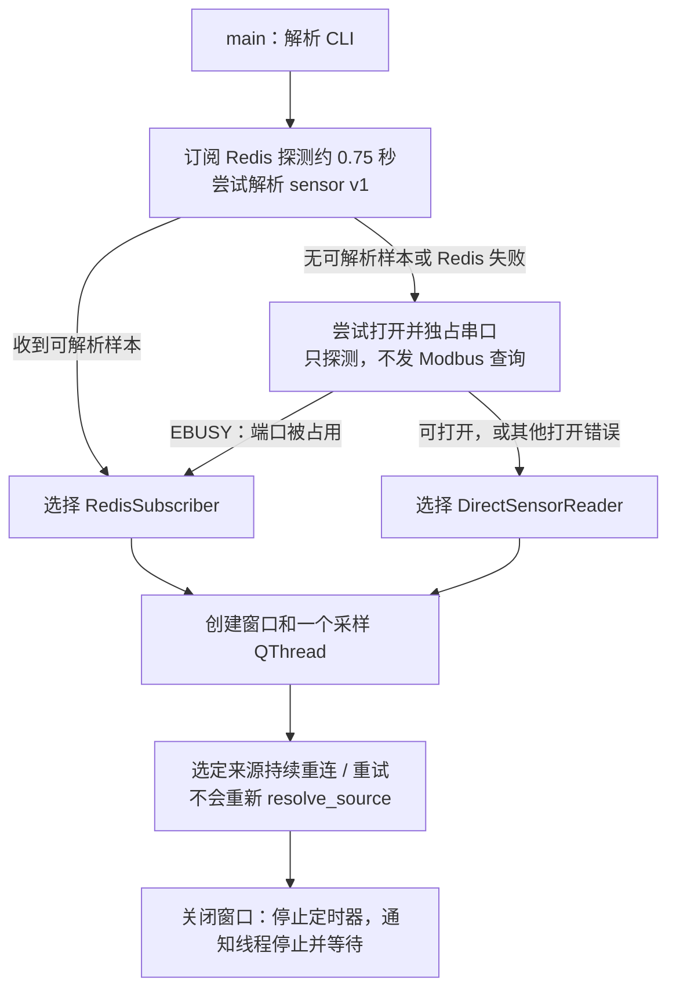
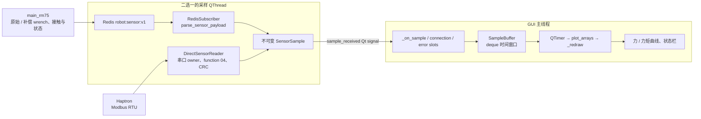
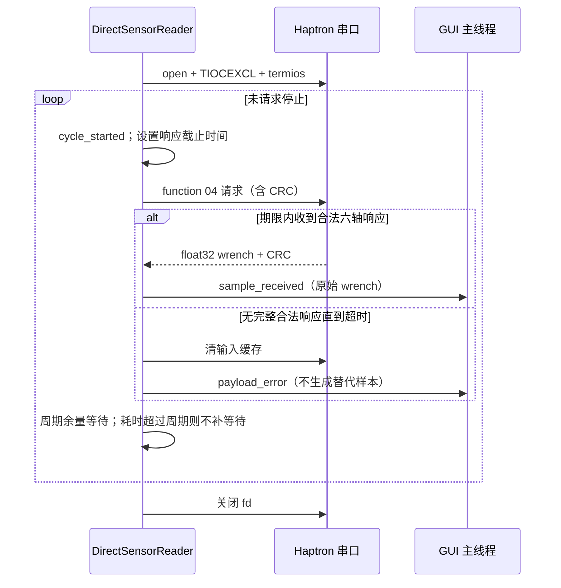

# SensorMonitor 架构

本文依据 **2026-10-02 当前工作区源码**。入口 [main.py](main.py) 是六维力传感器与 RM75
结构化遥测的只读监视器。启动时选定 Redis 或直连 Haptron，后台线程采样，GUI 线程缓存和绘图；
它不发布机器人命令、不执行 tare、重力补偿或接触估计。

## 实现状态与职责

| 能力 | 状态 | 当前边界 |
| --- | --- | --- |
| 自动选择 Redis / 直连来源 | 已实现 | 启动时选择一次，没有手动来源 CLI 或运行中自动切换 |
| Redis v1 解析、连接重试、原始 / 补偿曲线 | 已实现 | 补偿和接触结果由 Robot 计算，本监视器只读取 |
| 独占串口、只读 Modbus 查询、CRC 与有限值检查 | 已实现 | 115200 baud；直连只有原始 Sensor-frame wrench |
| 不可变样本、GUI 时间窗口和定时绘图 | 已实现 | 每样本发 Qt signal；没有显式的有界 signal 队列或样本合并层 |
| 序号 / 时间回退处理 | 已实现 | 清空窗口并接受新样本，显示 `stream reset`；不是拒绝回放协议 |
| 运行中切换来源、本地超时主动生成无效样本、严格 frame / units 校验 | 未实现 / 后续改进项 | 当前只能显示接收年龄和错误，不具备这些自动行为 |
| 力标定、空间接触点及现场测量精度验收 | 此监视器不执行 | 窗口能显示数据不代表测量或机器人控制已验收 |

## 数据源选择与生命周期



[resolve_source](main.py)优先探测 `robot:sensor:v1`，Pub/Sub 没有保留的最后样本。
“可解析”只表示协议结构能够转换成 `SensorSample`，不要求 `wrench_valid=true`，
也不证明消息发布者就是本次 Robot 进程。串口 `EBUSY` 也可能来自其他采集进程；
其他串口错误仍选择直连，让后台线程显示错误并重试。

串口探测调用 `_open_direct_sensor` 配置串口和 `TIOCEXCL` 后立即关闭，不发送查询。
选择后仅重试同一来源：Redis 断开不会转成直连，直连端口忙也不会自动改订阅 Redis。
要从直连监视切到 Robot 遥测，先退出监视器，启动 Robot，再重新打开监视器。

### CLI 配置与作用范围

所有参数由 [parse_arguments](main.py) 校验；没有 `--source`、tare 或运动参数。
修改 Redis 参数不代表强制选 Redis，自动探测仍使用下面的配置。

| 参数 | 默认值 / 允许范围 | 作用范围 |
| --- | --- | --- |
| `--host / --port / --channel` | `127.0.0.1` / `7777` / `robot:sensor:v1`；port 1～65535、channel 非空 | Redis 启动探测及选中后的订阅 |
| `--device / --baud` | `/dev/ttyUSB0` / `115200`；baud 仅接受 115200 | 串口启动探测及直连采集 |
| `--slave` | 1；1～247 | 直连 Modbus 地址；选源时不查询，因此不能证明此 slave 存在 |
| `--query-period-ms` | 20；10～1000 | 直连循环目标周期，包含读写耗时 |
| `--response-timeout-ms` | 50；10～1000 | 直连单次请求写入和响应的共同截止时间，可大于查询周期 |
| `--window-sec` | 20；10～30 的有限浮点数 | 两种来源的 GUI 缓存时间窗口 |
| `--refresh-hz` | 15；10～20 的有限浮点数 | 两种来源的 GUI QTimer；不改变后台采样周期 |

例如 `python infer/SensorMonitor/main.py --window-sec 30 --refresh-hz 10` 调整显示，
程序仍自动选源；若选择直连，该命令会独占串口并发送只读查询。本轮未执行该示例。

## 系统架构与线程归属



| 类 / 函数 | 所属阶段或线程 | 已实现职责 |
| --- | --- | --- |
| `parse_arguments`、`resolve_source` | GUI 启动前 | 校验 CLI、探测数据源 |
| `parse_sensor_payload` | Redis 探测 / 订阅线程 | 纯解析：v1 JSON → `SensorSample`，不修改 Redis |
| `RedisSubscriber` | QThread | ping、订阅、解析、发信号，断开后约 1 秒重试 |
| `DirectSensorReader` | QThread | 独占串口、查询 / 解析、接收时生成样本，错误后约 1 秒重开 |
| `SensorSample` | 不可变 DTO | SI wrench、显示用接触点 mm、有效位、I/O 和控制状态 |
| `SampleBuffer` | GUI 独占 | 清理回退流、裁切时间窗口、生成绘图数组 |
| `SensorMonitorWindow` | GUI 主线程 | 信号处理、曲线和接收年龄 / 错误显示、关闭生命周期 |

后台不直接操作窗口；GUI 不向后台返回控制意图。Robot 的遥测发布本身采用最新值合并，
监视器 Pub/Sub 可丢失中间样本；当前 Qt 层仍逐样本投递，不能宣称已经实现有界队列或严格零积压。

## Redis 数据契约与有效性

默认连接 `127.0.0.1:7777`，订阅 `robot:sensor:v1`；host、port、channel 可由 CLI 改写。
协议生产者为 [RedisBridge::BuildSensorV1Json](../Robot/src/redis_bridge.cpp)，
消费方为 `parse_sensor_payload`。

| 字段 | 当前解析 / 显示语义 |
| --- | --- |
| `version` | 仅接受值 1 的协议分支 |
| `sequence` | 转为整数并要求非负；窗口内不递增时重置缓存 |
| `timestamp_monotonic_ns` | 正值转秒；缺失或非正时用本地接收单调时间作为绘图时间 |
| `raw_wrench_sensor.force_n / torque_nm` | 三个有限数值，原始 Sensor-frame，单位 N / N·m，实线 |
| `compensated_wrench_tool.force_n / torque_nm` | 三个有限数值，Robot 补偿的 Tool-frame，虚线 |
| `contact.point_probe_m` | 三个有限数值；有效时乘 1000 转 mm，仅在内部 DTO / 状态语义中保留，不另画接触曲线 |
| `valid`、`sensor.checksum_valid / stale / io_error` | 联合决定 wrench 有效性 |
| `contact.valid` | 还须 wrench 有效才算接触点有效 |
| `sensor.io_status`、`control_state`、`fault` | 状态栏展示，不用于生成控制请求 |

```text
wrench_valid = message.valid AND sensor.checksum_valid
             AND NOT sensor.stale AND sensor.io_error == 0
contact_valid = wrench_valid AND contact.valid
```

| 输入情况 | 是否追加样本 | 曲线 / 状态结果 |
| --- | --- | --- |
| 完整有效消息 | 是 | 原始 / 补偿曲线更新，有效接触点转 mm |
| 完整消息但 wrench 无效 | 是 | 四组 wrench 为 NaN；contact 同时无效，曲线不以零代替测量 |
| 仅 contact 无效 | 是 | wrench 曲线继续，DTO 接触点为 NaN |
| 字段缺失、数组错误或非有限数 | 否 | 显示 payload 错误，保留现有曲线；无效位为 false 也不能免除数组检查 |
| 连接丢失或直连响应超时 | 否 | 显示连接 / 超时与接收年龄，不生成替代无效样本 |
| 序号或绘图时间不递增 | 是，先清空窗口 | 接受新样本，显示 stream reset，不作为协议防回放拒绝 |

绘图使用 `connect="finite"` 断开 NaN。当前解析是类型转换而非严格 JSON schema：
sequence / 时间 / io_error 调用 `int()`，有效位调用 `bool()`，数组元素调用 `float()`；
因此某些数值字符串也可被接受，非空字符串有效位会被当作真值。生产者应发送原生数值与布尔值，
严格类型校验属于后续改进，不能把现有解析描述成已经执行了 Robot 控制协议的严格检查。

两个坐标系的曲线不能直接按同名轴相减得到“补偿误差”。当前解析器不校验发布消息里的
`units/frame`、运行会话或消息年龄；绘图时间的接收后备值只用于展示，不能充当设备采样时刻。

## 直连 Modbus 数据流与关键时序

| 项目 | 当前实现 |
| --- | --- |
| 设备 / 总线 | 默认 `/dev/ttyUSB0`、115200 baud、8N1；默认 slave 1，可设 1～247 |
| 查询 | function `0x04`，起始寄存器 `0x0038`，12 个寄存器；8 字节请求含 CRC16 |
| 响应 | 24 字节 payload / 29 字节完整帧；`>6f` 大端浮点 `[Fx,Fy,Fz,Tx,Ty,Tz]`，CRC 低字节在前 |
| 错帧 | 丢弃噪声 / 本地回显 / CRC 错帧；合法 Modbus 异常帧或非有限值报错 |
| 时间 | 默认查询周期 20 ms，写入与响应共用默认 50 ms 截止时间；不是保证 50 Hz |
| 有效样本 | 本地递增 sequence、响应处理时的 `time.monotonic()`、原始 wrench |
| 缺失能力 | 补偿、接触、Robot 控制状态均无实际测量；以 NaN / false / `standalone` 表达 |



直连使用 Python 标准库 `os/select/termios/fcntl`，不依赖 pyserial，不发送校准或设置寄存器命令。
`TIOCEXCL` 用于避免与 Robot / 其他采集器同时打开串口；该模式与 Robot 的串口采集互斥。

## 显示时间、退出与当前缺口

| 行为 | 已实现规则 | 边界 |
| --- | --- | --- |
| 时间窗口 | 默认 20 秒，可设 10～30 秒；按最新样本时间裁切 | 没有独立样本数量上限 |
| 横轴 | 样本时间减最新样本时间，最新点固定为 0 | 无新样本时曲线不会按墙钟持续向左移 |
| 重绘 | 默认 15 Hz，可设 10～20 Hz | 仅绘图频率，不是采样或 Robot 控制频率 |
| 序号 / 时间回退 | 任一不严格递增时清空并接受新样本 | 可显示重启 / 回退，不负责控制协议防回放 |
| 状态 `age` | 当前主机单调时间减最后一次 GUI 接收时间 | 表示接收后经过多久，不是生产者或传感器曝光年龄 |
| 断流 / 无法解析 / 直连超时 | 状态栏显示错误；最后有效曲线保留 | 不主动重写旧有效位，也不追加 NaN 或清空曲线 |
| 关闭窗口 | 停 QTimer、置线程 stop event、先等待 2500 ms，必要时再等待 1500 ms | 等待是有界尝试，不是已经验证所有异常均及时退出 |

依赖 Python、redis-py、NumPy、pyqtgraph 及提供 `QtCore/QtWidgets` 的 Qt 绑定；当前从
`pyqtgraph.Qt` 获取 Qt 模块。后续可补本地断流无效样本、frame / units 校验、采样投递限流及
异常退出验证，但这些不在当前实现中。协议扩展应新增显式版本解析，保持只读职责。

本次仅进行文档和源码核对，未连接 Redis、串口或打开 GUI。控制与遥测生产侧见
[Robot 架构](../Robot/ARCHITECTURE.md)，全系统接口见[系统架构](../../ARCHITECTURE.md)。
